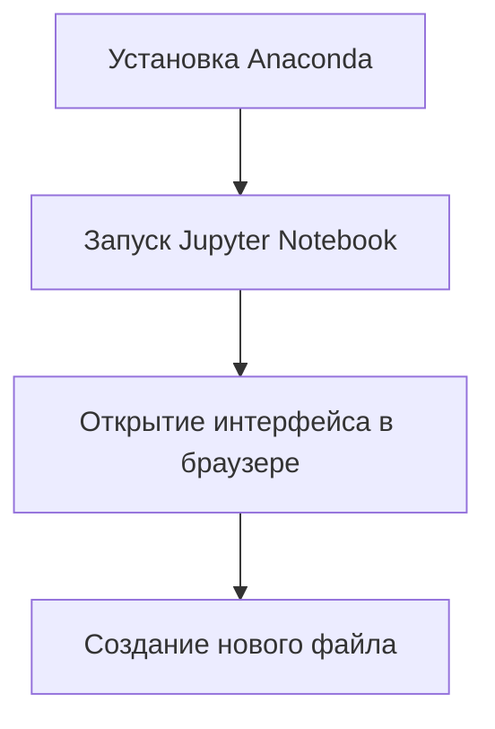

# Введение в использование Jupyter Notebook для работы с Python

## Что такое Jupyter Notebook

**Jupyter Notebook** — это интерактивная среда разработки, которая работает с Python и некоторыми другими языками программирования. Она устанавливается вместе с дистрибутивом Anaconda и представляет собой программу, интерфейс которой выполнен через браузер.

## Установка и запуск Jupyter Notebook

После установки Anaconda на свой компьютер вы получите доступ к Jupyter Notebook. При установке Anaconda создаёт специальную папку, которая будет использоваться для хранения файлов Jupyter Notebook. На Windows это обычно папка пользователя, а на MacOS — другая папка.

### Процесс установки и запуска Jupyter Notebook

## Создание и работа с файлами в Jupyter Notebook

### Создание нового файла

1. Откройте Jupyter Notebook.
2. Выберите папку для хранения файлов курса.
3. Нажмите кнопку «New» и выберите «Python 3».
4. Дождитесь загрузки интерфейса.

### Работа с ячейками

* Информация в Jupyter Notebook организована по ячейкам.
* Вы можете запускать код по кусочкам, выделяя ячейки и нажимая кнопку «Run» или сочетание клавиш «Shift + Enter».
* Переменные, созданные в одной ячейке, доступны в других ячейках, так как все ячейки работают в рамках единой сессии работы с Python.

### Сохранение и управление ячейками

* Для сохранения файла используйте кнопку «Save».
* Чтобы создать новую ячейку, выделите существующую ячейку и нажмите кнопку «+».
* Ячейки можно вырезать, копировать и вставлять с помощью соответствующих кнопок.
* С помощью стрелок можно перемещать ячейки вверх или вниз.

## Особенности работы с Jupyter Notebook

* **Интерактивность:** вывод под ячейкой помогает при работе с таблицами и визуализациями.
* **Поддержка формата IPynb:** этот формат поддерживает интерактивность и является стандартом для работы с данными.

## Маркуповский язык Markdown в Jupyter Notebook

**Markdown** — это язык текстовой разметки текста, который позволяет форматировать текст, создавать заголовки разного уровня, выделять жирным или курсивом. В Jupyter Notebook можно совмещать код и результат его работы, а также писать развёрнутые комментарии с помощью Markdown.

### Пример использования Markdown

`#` в этом случае означает сделать этот текст заголовком первого уровня.
`**Жирный текст**` отображается жирным шрифтом.

## Заключение

Мы рассмотрели основные элементы интерфейса Jupyter Notebook и особенности работы с ним. Далее мы перейдём к изучению новых библиотек и типов данных, которые помогут нам сделать работу с данными в Python более эффективной.

