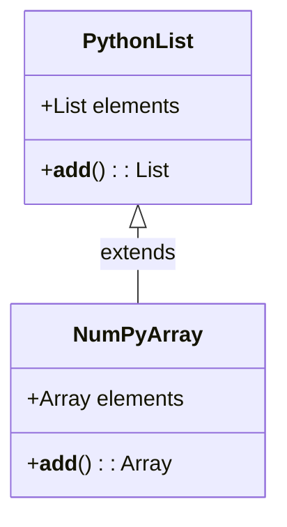
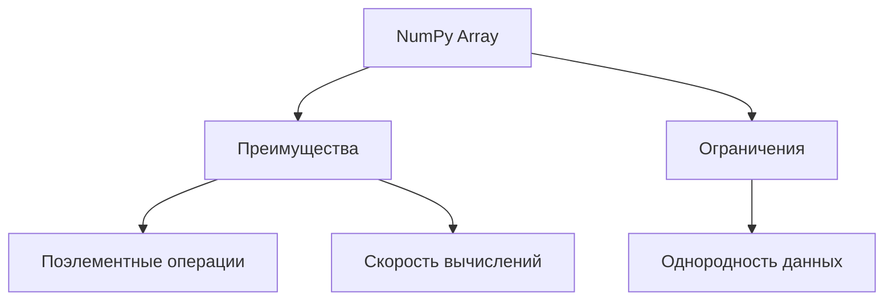

# Работа с данными в Python: библиотека NumPy

## Введение

В рамках курса предполагается, что слушатели уже знакомы с Python. Основное внимание уделяется дополнительным модулям и библиотекам, необходимым для работы с данными. Стандартная библиотека Python предоставляет ограниченный набор функций, поэтому для анализа данных используются сторонние библиотеки.

## Библиотеки для анализа данных

Для анализа данных применяются различные библиотеки, в зависимости от специализации пользователя. Среди них:

* **Pandas** — для работы с табличными данными;
* библиотеки для визуализации данных;
* **NumPy** — для вычислений.

### Библиотека NumPy

**NumPy** (сокращение от *Numerical Python*) — библиотека для вычислений в Python. Она вводит новый тип данных, который будет полезен при работе с данными.

#### Сравнение со стандартными списками Python

Стандартные списки Python имеют ограничения при выполнении операций с данными. Например, попытка сложить два списка приводит к их склейке, а не к поэлементному сложению.

```python
x = [1, 2, 3]
y = [4, 5, 6]
print(x + y)  # Выведет [1, 2, 3, 4, 5, 6]
```

#### Новый тип данных: NumPy array

Новый тип данных, **NumPy array**, позволяет выполнять поэлементные операции. Для его использования необходимо импортировать библиотеку NumPy:

```python
import numpy as np

x = np.array([1, 2, 3])
y = np.array([4, 5, 6])
print(x + y)  # Выведет [5, 7, 9]
```

### Преимущества NumPy array

* **Поэлементные операции**: возможность выполнения операций с каждым элементом массива.
* **Скорость вычислений**: вычисления с массивами NumPy выполняются быстрее, чем со стандартными списками Python.

### Ограничения NumPy array

* **Однородность данных**: массив NumPy может содержать только один тип данных. Если в массиве присутствуют разные типы данных, они приводятся к одному типу.

#### Пример

```python
z = ["строка", 1, 2.0, True]
z_np = np.array(z)
print(z_np)  # Все элементы массива станут строками
```

## Заключение

Массивы NumPy предоставляют мощные инструменты для работы с данными в Python. Они позволяют выполнять поэлементные операции и обеспечивают высокую скорость вычислений. Однако необходимо учитывать ограничения, связанные с однородностью данных.


```

### Диаграмма: Сравнение списков Python и массивов NumPy



**Пояснение:** Диаграмма показывает, что `NumPyArray` расширяет функциональность `PythonList`, добавляя возможность поэлементного сложения.

### Диаграмма: Преимущества и ограничения NumPy array



**Пояснение:** Граф иллюстрирует основные преимущества и ограничения массивов NumPy.