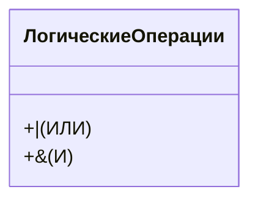
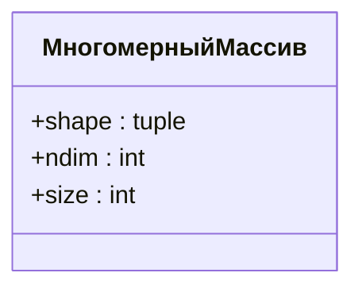

# Работа с массивами NumPy

## Определение и особенности массивов NumPy

**Массивы NumPy** (иногда их называют векторами) — это структуры данных, которые могут быть более удобными для использования, чем стандартные списки Python, особенно при выполнении арифметических операций и операций сравнения.

### Операции сравнения

При выполнении операций сравнения с массивами NumPy результат будет представлять собой массив логических переменных, описывающих исходный массив. Например, если сравнить массив с числом, то результатом будет массив, содержащий значения `True` или `False` в зависимости от того, выполняется ли условие для каждого элемента массива.

### Логические операции

При работе с массивами NumPy стандартные логические операторы Python `or` и `and` не работают. Вместо них используются операторы, аналогичные операторам для работы с множествами:

- **Объединение** (логическое ИЛИ) обозначается вертикальной чертой (`|`).
- **Пересечение** (логическое И) обозначается амперсандом (`&`).

Важно помнить, что при использовании этих операторов необходимо заключать операции в скобки, чтобы избежать ошибок.

## Многомерные массивы NumPy

Массивы NumPy могут иметь несколько измерений. Например, таблица представляет собой массив двух измерений, у которого есть количество колонок и количество рядов.

### Атрибуты многомерных массивов

Многомерные массивы NumPy имеют атрибуты, которые позволяют получить информацию о их размере и структуре:

- **`shape`** — показывает размерность массива.
- **`ndim`** — количество измерений массива.
- **`size`** — общее количество элементов в массиве.

### Индексация многомерных массивов

Для доступа к элементам многомерного массива NumPy можно использовать двойную индексацию или указывать координаты элемента в квадратных скобках. Также можно использовать срезы для получения информации по колонкам или рядам.

