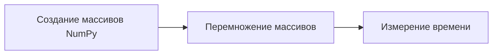
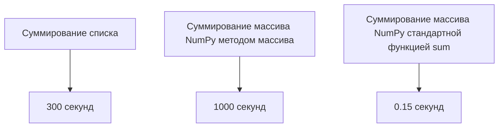

# Анализ производительности в Python

## Импорт библиотеки time и её использование

Для замера времени выполнения кода используется библиотека `time`. Она позволяет отслеживать, сколько времени занимает выполнение определённых операций.

```python
import time
```


## Эксперимент с перемножением списков

Создаются два списка по 1 миллиону элементов каждый. Затем выполняется их перемножение с использованием спискового включения. Время выполнения операции измеряется с помощью библиотеки `time`.

```python
# Инициализация числа элементов в списках
n = 1_000_000

# Создание двух списков
list1 = list(range(n))
list2 = list(range(n))

# Запоминание времени начала операции
start_time = time.time()

# Перемножение списков
result_list = [x * y for x, y in zip(list1, list2)]

# Запоминание времени окончания операции
end_time = time.time()

# Вычисление времени выполнения операции
execution_time = end_time - start_time
print(f"Время выполнения: {execution_time} секунд")
```

Результат выполнения: примерно **0,16 секунды**.


## Сравнение с массивами NumPy

Выполняется аналогичный эксперимент с использованием массивов NumPy. Время выполнения операции также измеряется.




Результат выполнения: значительно меньше, чем у списков, примерно в **45 раз быстрее**.

## Эксперимент с суммированием элементов

Проводится сравнение времени выполнения операции суммирования элементов списка и массива NumPy.

1. Суммирование элементов списка с использованием стандартной функции `sum`.
2. Суммирование элементов массива NumPy с использованием метода массива.
3. Суммирование элементов массива NumPy с использованием стандартной функции `sum`.

Результаты выполнения:
- Суммирование списка: **300 секунд**.
- Суммирование массива NumPy методом массива: **1000 секунд**.
- Суммирование массива NumPy стандартной функцией `sum`: **15 сотых секунд**.




## Выводы

- Использование нативных методов для работы с новыми типами данных может значительно ускорить выполнение операций.
- Стандартные функции могут показывать худший результат при работе с новыми типами данных.

