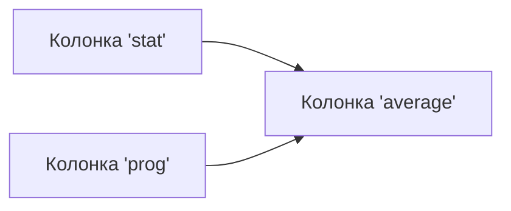

# Работа с табличными данными в библиотеке PANDAS

## Введение

Библиотека **PANDAS** предназначена для работы с табличными данными. Она позволяет загружать данные, эффективно манипулировать ими и выполнять сложные операции.

### Почему PANDAS?

- **PANDAS** может заменить использование Google Tablets или Excel.
- Имеет отличную документацию, которая поможет разобраться в работе функций и возможностях библиотеки.

## Импорт библиотеки

Для работы с **PANDAS** необходимо её импортировать. В дистрибутиве Anaconda самые популярные библиотеки для анализа данных, включая **PANDAS** и **NumPy**, уже установлены.

```python
import pandas as pd
```

## Создание датафрейма

**Датафрейм** — это объект, который хранит и отображает табличные данные.

```python
df = pd.DataFrame()
```

### Добавление данных в датафрейм

Можно добавить данные в датафрейм, создав колонку с оценками для трёх студентов по курсу статистики.

```python
df['stat'] = [9, 10, 7]
```

## Работа с колонками

В **PANDAS** можно обращаться к колонкам по имени. Синтаксис работы с колонками похож на синтаксис работы со словарями.

```python
print(df['stat'])
```

### Атрибуты колонки

У колонки есть атрибуты, которые можно вывести. Например, атрибут `dtype` показывает тип данных, которые содержатся в колонке.

```python
print(df['stat'].dtype)
```

## Создание новой колонки на основе существующих

Можно создать новую колонку, выполнив вычисления с двумя уже существующими колонками.

```python
df['average'] = (df['stat'] + df['prog']) / 2
```

### Взаимосвязь между колонками



На диаграмме выше показано, как колонка 'average' создается на основе колонок 'stat' и 'prog'.

## Заключение

Мы рассмотрели, как создать пустой датафрейм, добавить в него данные, посмотреть структуру колонки и создать новую колонку, выполнив вычисления с двумя уже существующими.


