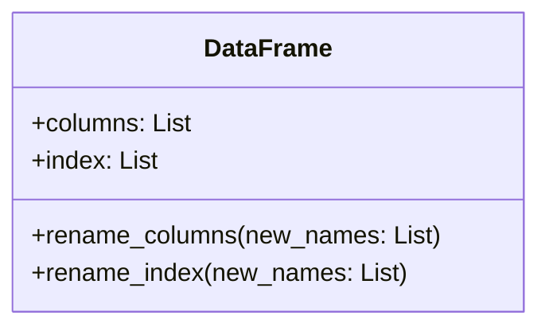
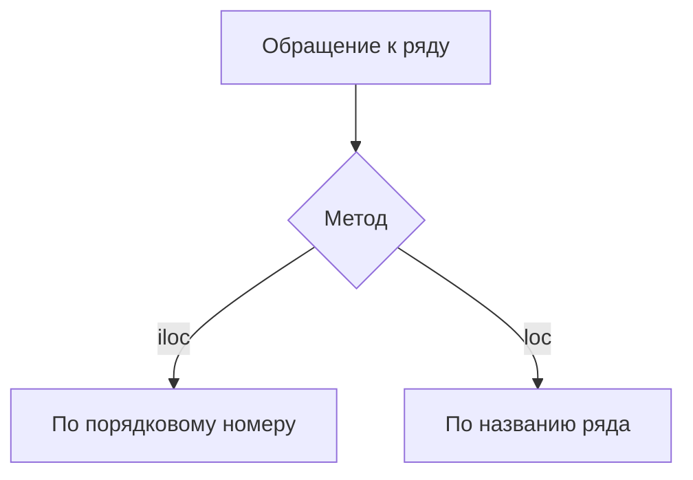
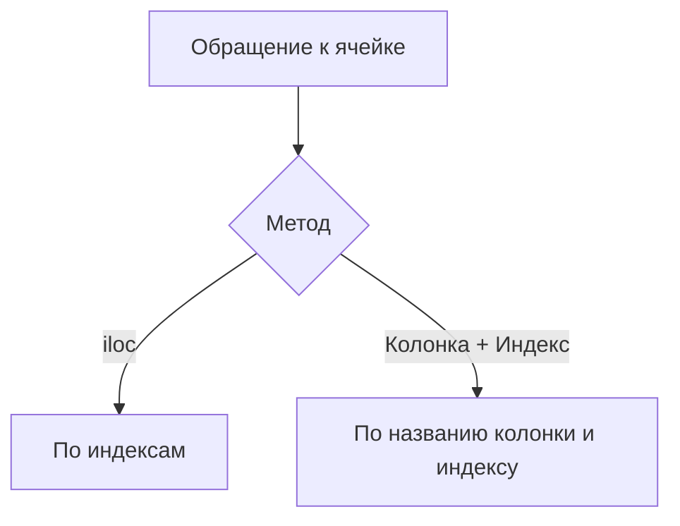
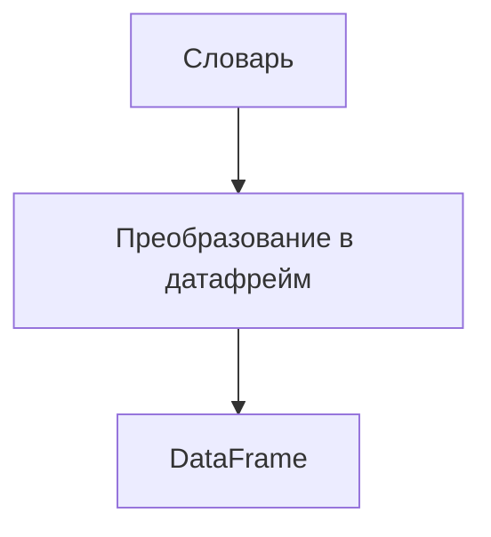

# Работа с датафреймами

## Обращение к колонкам

Для выбора данных из датафрейма можно использовать различные методы. Например, для вызова одной колонки используется команда `DF['Prok']`, которая выведет все оценки, принадлежащие этой колонке.

Для вывода информации из двух колонок можно передать список названий колонок в квадратных скобках. Например, `DF[['статц', 'Эвердж']]`.

*Важно отметить, что пандоссиреозь всегда одномерный, поэтому если нужно вывести больше одной колонки, то получится датафрейм.*

Если вам не нравится порядок колонок, в котором они выводятся, вы всегда можете его поменять и, например, сохранить. Для этого нужно указать названия колонок в нужном порядке.

## Атрибуты датафрейма

У датафрейма есть два атрибута, которые часто используются:

* `DF.columns` — объект, в котором есть все колонки датафрейма.
* `DF.index` — объект, который отвечает за индексацию.

### Изменение имён колонок

Можно присваивать новые значения объектам `DF.columns` и `DF.index`, тем самым меняя имена колонок и индекса. Например, можно переименовать колонки, передав список из новых названий.


*Диаграмма показывает основные атрибуты и методы датафрейма, связанные с колонками и индексами.*

```

```

## Обращение к рядам и конкретным значениям

Чтобы достать ряд из таблицы, можно использовать атрибут `iloc`. Например, `DF.iloc[0]` выведет оценки для первого студента.

Кроме `iloc`, можно использовать `loc`. Оба метода позволяют обращаться к рядам, но `iloc` использует порядковый номер ряда, а `loc` — название ряда.


*Диаграмма иллюстрирует два метода обращения к рядам в датафрейме.*

```


```

## Обращение к значению в ячейке

Обратиться к значению в ячейке можно разными способами. Например, для получения оценки по статистике для первой студентки можно использовать `DF.iloc[0, 1]` или `DF['дестатс'][0]`.


*Диаграмма показывает два способа обращения к значению в ячейке датафрейма.*

```


```

## Преобразование словаря в датафрейм

Словарь, стандартный пайтовский словарь, очень легко преобразуется в датафрейм. Для этого нужно создать словарь с ключами и значениями, а затем запустить код для преобразования в датафрейм.


*Диаграмма иллюстрирует процесс преобразования словаря в датафрейм.*

```
