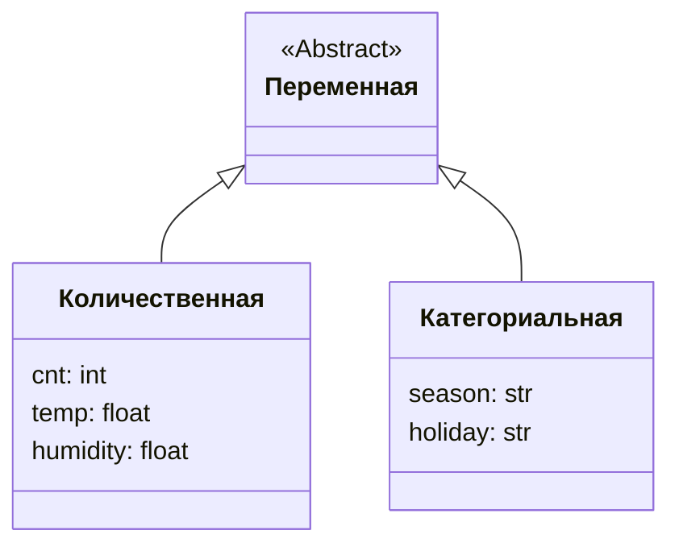

# Работа с датасетом: анализ данных по аренде велосипедов

## Открытие и первичное изучение датасета

Для работы с данными используется библиотека **Pandas**. Данные представлены в формате CSV и разделены запятой.

```python
pd.read_csv()
```

При большом объёме данных **Pandas** отображает только первые и последние пять строк.


В данных содержится 8760 строк и 12 колонок.

### Методы для отображения данных

- **head()**: отображает первые пять строк датафрейма. Можно передать аргумент, чтобы увидеть определённое количество строк.
  
- **tail()**: отображает последние строки датафрейма.
  
- **iloc[]**: позволяет выбрать конкретные строки с помощью среза.
  

## Переменные в датасете


Переменные в датасете включают:

- **date**: дата в формате день, месяц, год.
- **hour**: час в формате от 0 до 23.
- **cnt**: общее количество арендованных велосипедов.
- **temp**: температура в градусах Цельсия.
- **humidity**: влажность в процентах.
- **windspeed**: скорость ветра в метрах в секунду.
- **rainfall**: количество осадков в миллиметрах.
- **snowfall**: количество снега в сантиметрах.
- **season**: сезон (зима, весна, лето, осень).
- **holiday**: указывает, был ли день праздником (holiday или no_holiday).
- **workingday**: указывает, был ли прокат открыт (1 — открыт, 0 — закрыт).


## Типы переменных

Переменные могут быть количественными или категориальными. Количественные переменные выражены числами, а категориальные — словами или категориями.



Примеры количественных переменных:
- **cnt**: количество арендованных велосипедов.
- **temp**: температура.
- **humidity**: влажность.

Примеры категориальных переменных:
- **season**: зима, весна, лето, осень.
- **holiday**: holiday, no_holiday.

