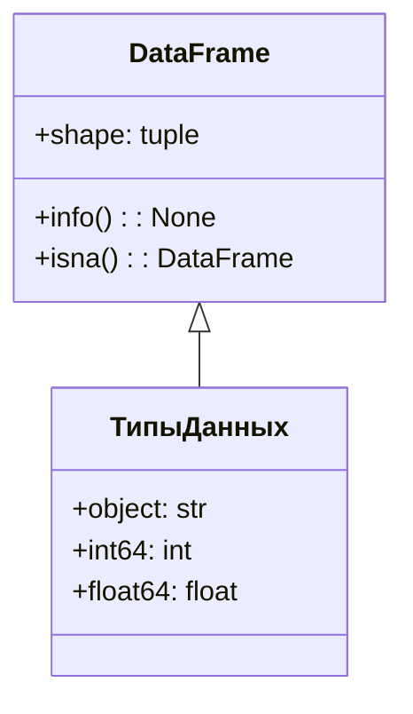
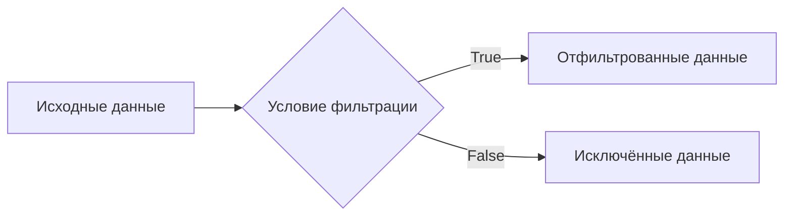
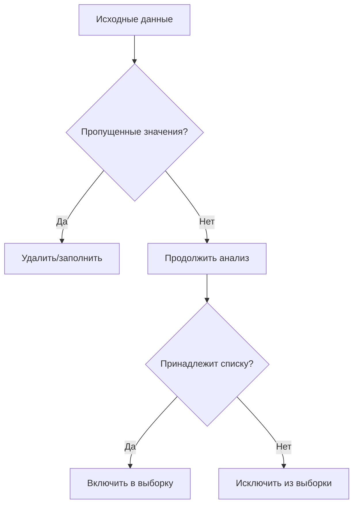

# Обработка данных с использованием Pandas

## Изучение датасета

После загрузки данных и определения переменных можно приступить к их анализу с помощью библиотеки Pandas.

### Основные методы

1. **Просмотр структуры датасета:**
   - `shape` — позволяет узнать количество строк и столбцов в датасете.
   - `info()` — предоставляет информацию о типах данных, индексе и количестве ненулевых значений в каждом столбце.

     
     

2. **Работа с пропущенными значениями:**
   - Пропущенные значения могут быть представлены пустыми ячейками или специальным значением `NaN`.
   - Метод `isna()` позволяет проверить, является ли значение пропущенным.

3. **Типы данных:**
   - В Pandas типы данных представлены как `object` (строка), `int64` (целое число) и другие.
   - Понимание типов данных важно для правильного анализа и обработки информации.



*Диаграмма выше иллюстрирует основные методы и типы данных в Pandas.*

## Фильтрация данных

Фильтрация позволяет выбрать подмножество данных на основе определённых условий.

### Операции сравнения

Операции сравнения выполняются поэлементно и возвращают массив логических значений (`True` или `False`). Этот массив можно использовать для фильтрации данных.

Пример:
```python
bikes[bikes['holiday'] == True]
```

### Логические операторы

Логические операторы (`&`, `|`, `~`) позволяют комбинировать условия для более сложной фильтрации.

- `&` — логическое «И» (пересечение множеств).
- `|` — логическое «ИЛИ» (объединение множеств).
- `~` — логическое «НЕ» (отрицание).

Пример:
```python
bikes[(bikes['holiday'] == True) & (bikes['temperature'] > 15)]
```

  
  
  



*Диаграмма показывает процесс фильтрации данных на основе условий.*

### Методы Pandas для фильтрации

Pandas предоставляет специальные методы для работы с пропущенными значениями и интервалами.

- `isna()` — проверяет, является ли значение пропущенным.
- `isin()` — проверяет принадлежность значения списку.
- Интервалы можно задавать с помощью оператора `range`.

Примеры:
```python
# Выбор строк с пропущенными значениями в столбце 'temperature'
bikes[bikes['temperature'].isna()]

# Выбор строк, где значение в столбце 'season' равно 'winter' или 'summer'
bikes[bikes['season'].isin(['winter', 'summer'])]

# Выбор строк, где значение в столбце 'temperature' находится в интервале от 15 до 25
bikes[bikes['temperature'].isin(range(15, 26))]
```

  



*Диаграмма иллюстрирует процесс фильтрации данных с использованием методов Pandas.*