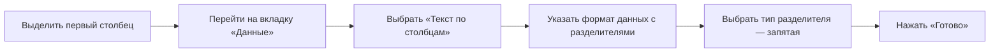
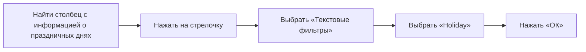
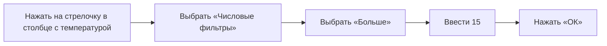

# Работа с данными в формате CSW

## Преобразование данных в удобный формат

Данные представлены в формате CSW (comma-separated values), где значения разделены запятыми. Для удобства работы необходимо преобразовать данные в табличный вид. Процесс преобразования включает следующие шаги:

После выполнения этих шагов данные будут представлены в удобном для работы табличном виде.   

## Фильтрация данных

Для отбора части данных, интересных для конкретной задачи, используется фильтрация. Процесс фильтрации включает следующие этапы:

1. Во вкладке «Данные» нажать на кнопку «Фильтр».
2. В заголовках столбцов появятся стрелочки, в которых находится возможность отфильтровать данные.

Например, можно отобрать данные о аренде велосипедов в праздничные дни:

Теперь отображаются только записи о аренде велосипедов в праздничные дни. 

Можно сделать более сложную сортировку и фильтрацию по нескольким столбцам. Например, отобрать наблюдения, которые были записаны в праздничные дни и при температуре выше 15 градусов:

Теперь отображаются только записи о аренде велосипедов в праздничные дни при температуре выше 15 градусов. 

## Сортировка данных

Данные можно сортировать по возрастанию и по убыванию. Процесс сортировки включает следующие шаги:

1. Сбросить фильтр.
2. Нажать на стрелочку в столбце с температурой.
3. Выбрать «Сортировка по возрастанию» или «Сортировка по убыванию».

Теперь данные отсортированы по температуре. Можно сортировать по нескольким столбцам, например, сначала по влажности по возрастанию, а потом по температуре по убыванию.

## Заключение

В этом видео мы познакомились с двумя важными функциями — фильтрацией и сортировкой. Теперь вы можете отобрать часть наблюдений, которые вам наиболее интересны, а также посмотреть наибольшие или наименьшие значения с помощью сортировки данных. 