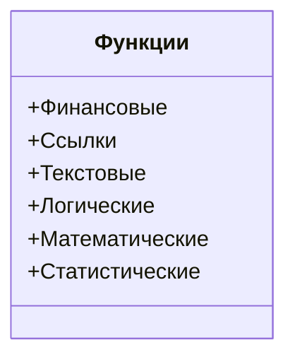

# Формулы и функции в Excel

## Основные принципы работы с формулами

В Excel можно использовать формулы для выполнения различных вычислений. Например, можно привести цены из долларов в рубли, используя формулу умножения на курс доллара.

1. В столбце A введены цены в долларах.
2. В столбце B нужно получить цены в рублях.
3. В ячейке B1 ставим курсор и вводим знак «=» для обозначения начала формулы.
4. Кликаем на ячейку с ценой в столбце A и умножаем её на курс доллара, например, на 75.
5. Нажимаем Enter, и получаем цену в рублях.

Для применения формулы ко всему столбцу:

- Выделяем ячейку с рассчитанной ценой в рублях.
- Зацепляемся за нижний правый угол ячейки, чтобы курсор стал чёрным крестиком.
- Тянем вниз, чтобы растянуть формулу на весь столбец.

### Работа с изменяемыми данными

Если курс доллара изменится, можно изменить значение в ячейке с курсом, и все вычисления автоматически обновятся. Для этого:

1. Создаём отдельную ячейку для курса доллара (например, F1).
2. Изменяем формулу в ячейке B1 так, чтобы она ссылалась на ячейку F1.
3. Растягиваем формулу на весь столбец.

При изменении курса в ячейке F1 все цены в столбце B автоматически пересчитаются.

### Фиксация ячеек

Если необходимо, чтобы формула всегда ссылалась на одну и ту же ячейку, можно зафиксировать её адрес с помощью знака доллара ($). Например, если зафиксировать ячейку F1, то при растяжении формулы вниз она всегда будет ссылаться на F1.

## Функции в Excel

Excel предоставляет множество функций для автоматического вычисления различных значений. Например, функция `СУММ` позволяет вычислить сумму значений в диапазоне ячеек.

Чтобы использовать функцию `СУММ`:

1. Вводим знак «=» в ячейке, где хотим получить результат.
2. Вводим название функции `СУММ`.
3. Открываем круглую скобку и выделяем диапазон ячеек, которые хотим сложить.
4. Закрываем круглую скобку и нажимаем Enter.

Также в Excel есть функции для вычисления среднего значения, максимального, минимального и т. д. Для поиска нужной функции можно использовать мастер функций (значок `F(x)`).

 

### Категории функций

Функции в Excel разделены по категориям: финансовые, ссылки, текстовые, логические, математические и т. д. В рамках курса мы будем использовать статистические и логические функции.

*Диаграмма выше иллюстрирует основные категории функций в Excel.*

### Недавно использовавшиеся функции

10 недавно использовавшихся функций сохраняются в отдельной категории, что удобно для частого использования.

 

### Поиск функций

Если вы не помните точное название функции, можно найти её в нужном списке и прочитать описание. Например, функция `MAX` возвращает наибольшее значение из списка аргументов.

## Заключение

Мы познакомились с основными принципами работы с формулами и функциями в Excel. В следующих видео мы будем использовать эти инструменты для анализа данных и их обработки.

