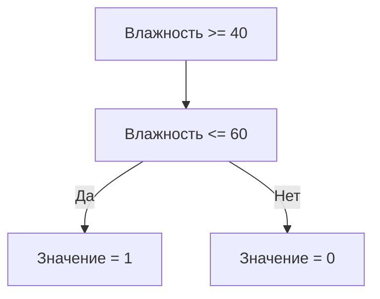

# Создание новых переменных на основе существующих данных

## Создание переменной для общего количества аренд

Для вычисления общего количества аренд за конкретный час необходимо сложить количество аренд для первого и второго партнёра. Создадим новую переменную `rental count` для хранения результата.

1. В столбце CM создаём новую переменную `rental count`.
2. В ячейке столбца CM записываем формулу: `=K2 + L2`, где K2 и L2 — ячейки с количеством аренд для первого и второго партнёра соответственно.
3. Для автоматического заполнения всего столбца используем двойной щелчок по правому нижнему углу ячейки с формулой.

  
  
  

## Создание бинарной переменной для праздников

Иногда удобнее использовать бинарные переменные (0 или 1) вместо текстовых категорий. Создадим переменную, которая будет принимать значение 1, если был праздник, и 0, если не было.

1. Используем логическую функцию `ЕСЛИ` для создания переменной.
2. Логическое выражение: `ячейка с праздником = "праздник"`.
3. Если выражение истинно, значение переменной — 1; если ложно — 0.
4. Заполняем столбец двойным щелчком по правому нижнему углу ячейки с формулой.

```mermaid
flowchart TD
    A[Ячейка с праздником = \n\"праздник\"?] -->|Да| B[Значение = 1]
    A -->|Нет| C[Значение = 0]
```

## Преобразование существующей переменной

Можно изменить существующую переменную, заменив текстовые значения на числовые. Однако это может привести к нежелательным результатам, если не учитывать особенности функции замены.

1. Выделяем столбец с переменной.
2. Идём на вкладку «Главная» и выбираем функцию «Заменить».
3. Вводим значение для поиска и замены.
4. Учитываем дополнительные параметры, такие как «Ячейка целиком», чтобы избежать нежелательных замен.

  

## Создание переменной по сложным условиям

Создадим переменную, которая будет принимать значение 1 для нормальной влажности (от 40 до 60 включительно) и 0 для слишком низкой или высокой влажности.

1. Используем функцию `ЕСЛИ` с логическим выражением, объединяющим два условия: влажность больше или равна 40 и влажность меньше или равна 60.
2. Записываем формулу в ячейку столбца с новой переменной.
3. Заполняем столбец двойным щелчком по правому нижнему углу ячейки с формулой.



  
  
  