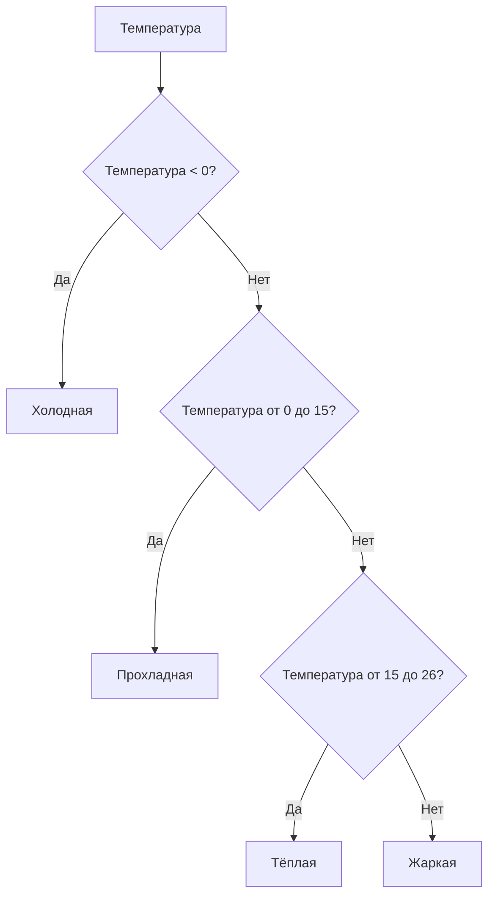
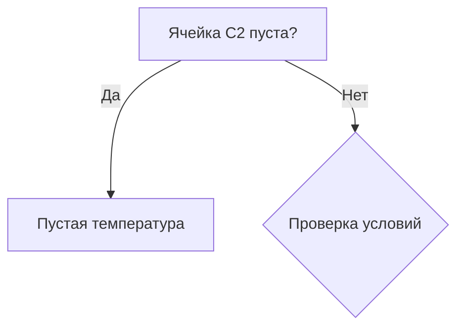

# Создание переменной с несколькими значениями

## Определение переменной «Температура»

В данном разделе рассматривается создание переменной *температура*, которая будет принимать четыре значения: холодная, прохладная, тёплая или жаркая.

### Условие для переменной

Для определения значения переменной *температура* используются следующие условия:

1. Если температура меньше 0, то значение переменной — «холодная».
2. Если температура от 0 до 15, то значение переменной — «прохладная».
3. Если температура от 15 до 26, то значение переменной — «тёплая».
4. Если температура больше 26, то значение переменной — «жаркая».

Диаграмма выше иллюстрирует процесс определения значения переменной *температура* на основе заданных условий.

### Вложенные функции «если»

Для реализации условий используется вложенная функция «если». Это позволяет последовательно проверять условия и присваивать соответствующее значение переменной.

## Обработка пустых ячеек

При работе с данными может возникнуть ситуация, когда ячейка с температурой пуста. В этом случае необходимо предусмотреть условие, чтобы переменная *температура* также оставалась пустой.

Для этого добавляется дополнительное условие в начале функции «если»: если ячейка C2 пуста, то ячейка с температурой также должна быть пустой. Только если в ячейке C2 есть значение, начинается проверка условий для определения температуры.

Диаграмма показывает логику обработки пустых ячеек в данных.

## Анализ данных с помощью фильтра

После внесения изменений в формулу можно использовать фильтр для анализа данных. Например, можно узнать количество записей с определённым типом температуры.

### Пример использования фильтра

- Отбор записей с тёплой температурой показывает 2778 записей.
- Отбор записей с холодной температурой показывает 1412 записей.

## Заключение

В результате мы научились создавать переменные, которые принимают несколько значений со сложными условиями, а также проверять, являются ли наши значения пустыми, и прописывать функции для тех случаев, когда у нас есть пропущенное значение.