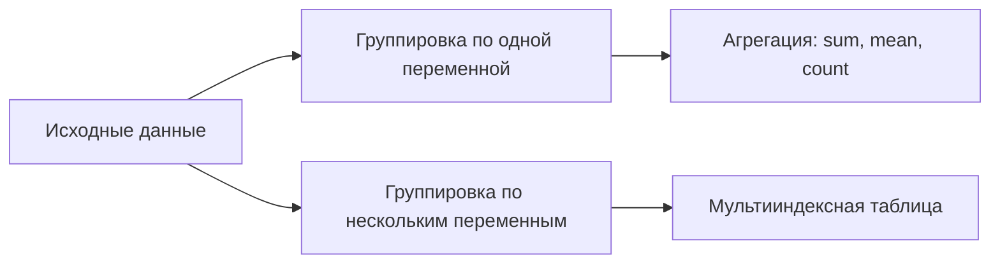

# Группировка и агрегация данных в Pandas

## Частотные таблицы

Частотная таблица позволяет увидеть, сколько раз каждое значение категориальной переменной встречается в данных. Для построения частотной таблицы используется метод `value_counts()`.

Пример построения частотной таблицы для переменной `temperature_category`:
```python
temperature_category.value_counts()
```

По умолчанию `value_counts()` возвращает отсортированный список, где верхняя строка — самая популярная категория.

Если в переменной есть пропущенные значения, они не учитываются по умолчанию. Чтобы включить их в расчёт, можно использовать параметр `dropna=False`.


## Группировка данных

Группировка данных позволяет агрегировать информацию по определённому признаку. Например, можно узнать общее количество арендованных велосипедов за каждый день.

Для группировки данных используется метод `groupby()`. В скобках указывается название колонки, по которой будет производиться группировка. Затем в квадратных скобках указывается название переменной, которая интересует исследователя.

Пример группировки данных по дате и подсчёта общего количества арендованных велосипедов:
```python
rental_count = df.groupby('date')['rental_count'].sum()
```

После группировки данных можно использовать различные агрегатные функции, такие как `sum()`, `mean()`, `count()` и т. д.

### Пример группировки данных по нескольким переменным

Можно группировать данные по нескольким переменным одновременно. Например, можно узнать, как часто велосипеды арендовались в зависимости от сезона и категории температуры.

Пример группировки данных по сезонам и категориям температуры:
```python
df.groupby(['season', 'temperature_category'])['rental_count'].sum()
```

Это позволит получить таблицу с более сложным мультииндексом, где каждая строка будет соответствовать определённой комбинации сезона и категории температуры.

### Визуализация группировки данных



На диаграмме показан процесс группировки данных и их последующей агрегации, как по одной, так и по нескольким переменным.


