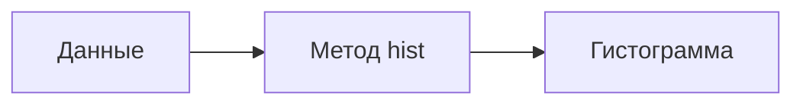
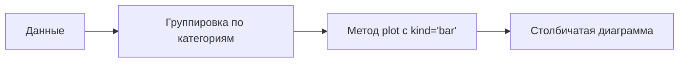
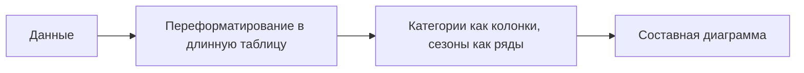

# Визуализация данных: гистограммы и столбичатые диаграммы

## Инструменты визуализации

Для визуализации данных можно использовать различные инструменты. В данном случае мы рассмотрим использование библиотеки для визуализации, которая интегрирована с *pandas*.

### Гистограмма для количественных переменных

Гистограмма позволяет визуализировать распределение количественной переменной. Для построения гистограммы можно использовать метод `hist`.

По умолчанию гистограмма строится с 10 отрезками. Высота столбика определяется количеством записей, попадающих в каждый отрезок.

Можно регулировать количество отрезков, указав параметр `bins`. Например, можно указать `bins=20`, чтобы разбить переменную на большее количество отрезков.

### Столбичатая диаграмма для категориальных переменных

Для категориальных переменных можно использовать столбичатую диаграмму. Перед построением диаграммы необходимо сгруппировать данные по категориям.

Для построения диаграммы можно использовать функцию `plot` с параметром `kind='bar'`.

Столбичатая диаграмма позволяет увидеть распределение категорий. Например, можно увидеть, что прохладных дней было больше всего, хороших дней — на втором месте и так далее.

## Группировка данных

Иногда может потребоваться создать частотную таблицу с группировкой по определённому признаку. В этом случае можно использовать метод `groupby` и `size`.

При группировке данных важно учитывать порядок категорий. По умолчанию категории идут в алфавитном порядке, но можно отсортировать их по частоте встречаемости.

## Составные диаграммы

Можно создать составную диаграмму, где каждый столбик будет представлять собой сумму нескольких категорий. Для этого необходимо предварительно переформатировать данные в длинную таблицу Лилон-Тейпл.

В длинной таблице категории становятся колонками, а сезоны — рядами. На пересечении ряда и колонки находится значение, соответствующее количеству записей в данной категории для данного сезона.

После переформатирования данных можно построить составную диаграмму с помощью функции `plot` и параметра `kind='bar'`.

