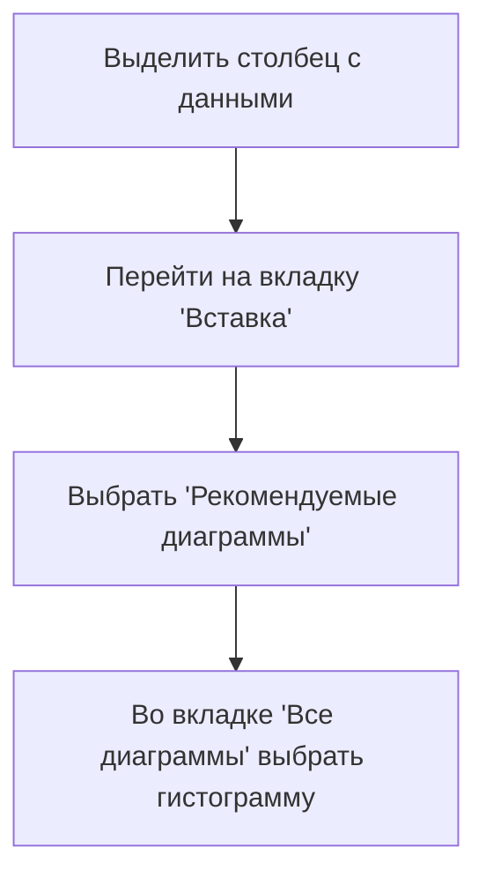
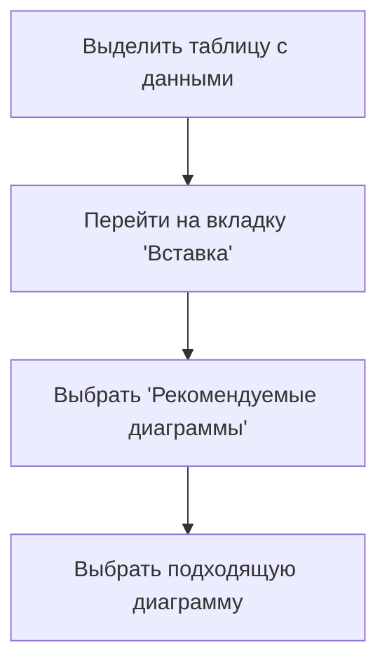

# Работа с данными в Excel: построение частотных таблиц и диаграмм

## Подсчёт частоты значений с помощью функции `СЧЁТЕСЛИ`

В Excel можно подсчитать количество наблюдений для каждого типа данных с помощью функции `СЧЁТЕСЛИ`. Эта функция имеет два аргумента:

1. **Диапазон**, в котором нужно искать значения.
2. **Критерий поиска**.

Например, чтобы подсчитать количество наблюдений с жаркой погодой в столбце P, нужно ввести следующую формулу в ячейку S2:

```excel
=СЧЁТЕСЛИ(P:P; "жаркое")
```

После нажатия Enter в ячейке S2 появится количество наблюдений с жаркой погодой.

### Оптимизация подсчёта частоты значений

Если нужно подсчитать количество наблюдений для нескольких значений, можно оптимизировать процесс. Вместо того чтобы вручную прописывать каждое значение в функции `СЧЁТЕСЛИ`, можно указать ячейку, в которой это значение находится.

Например, если в ячейке R2 указано значение "жаркое", можно использовать следующую формулу:

```excel
=СЧЁТЕСЛИ(P:P; R2)
```

Затем можно растянуть формулу на все необходимые строки. Excel будет искать в столбце P значения, которые находятся в ячейках слева от ячеек с формулами.


## Подсчёт суммарного количества аренд с помощью функции `СУММЕСЛИ`

Для подсчёта суммарного количества аренд для каждого сезона можно использовать функцию `СУММЕСЛИ`. Эта функция имеет три аргумента:

1. **Диапазон**, в котором нужно искать наблюдения по определённому критерию.
2. **Критерий поиска**.
3. **Диапазон суммирования**.

Например, чтобы подсчитать суммарное количество аренд для осени, можно использовать следующую формулу:

```excel
=СУММЕСЛИ(диапазон_сезонов; "осень"; диапазон_аренд)
```

Затем можно растянуть формулу на все необходимые строки.


## Визуализация распределения частот

Распределение частот можно визуализировать с помощью гистограммы или столбчатой диаграммы.

### Процесс построения гистограммы



Гистограмма позволяет наглядно отобразить распределение частот данных.


### Процесс построения столбчатой диаграммы



Столбчатая диаграмма подходит для сравнения частот различных категорий.

