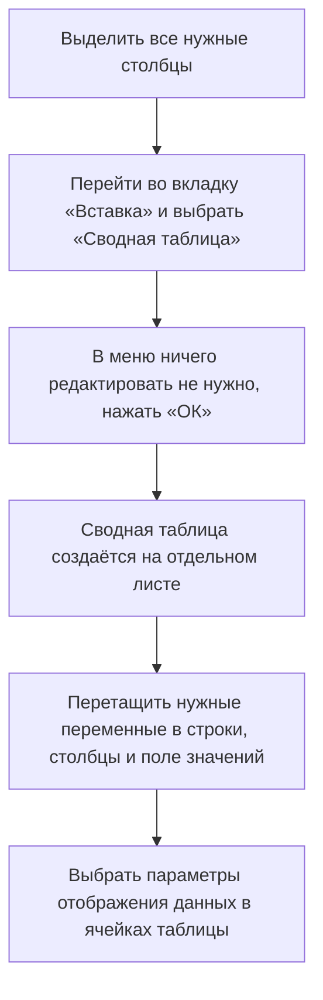

# Сводные таблицы в Excel

## Область применения

Сводные таблицы используются для создания частотных таблиц и объединения данных более удобным способом. Они позволяют быстро и эффективно анализировать большие объёмы данных.

## Задачи

С помощью сводных таблиц можно решать следующие задачи:

- Создание частотных таблиц для подсчёта количества записей по категориям.
- Объединение данных из разных категорий для анализа их взаимосвязи.
- Подсчёт суммы, среднего значения, максимального значения и других параметров по подкатегориям.
- Визуализация данных с помощью диаграмм.

## Инструменты и особенности

Для создания сводной таблицы необходимо выполнить следующие шаги:

_Диаграмма выше иллюстрирует процесс создания сводной таблицы в Excel._

### Преимущества сводных таблиц

- **Быстрота и удобство:** сводные таблицы позволяют быстро создавать частотные таблицы и объединять данные.
- **Гибкость:** можно легко изменять параметры отображения данных и создавать разные виды диаграмм.
- **Наглядность:** диаграммы позволяют визуализировать данные и легче воспринимать информацию.

### Ограничения сводных таблиц

- **Зависимость от структуры данных:** сводные таблицы требуют определённой структуры данных для корректной работы.
- **Сложность настройки:** некоторые параметры отображения данных могут быть сложными для настройки.

## Примеры использования

### Пример 1: Частотная таблица по сезонам

1. Перетащить сезоны в строки.
2. Перетащить количество аренд в поле значения.
3. Получить таблицу с количеством записей для каждого сезона.

### Пример 2: Таблица с сочетанием сезонов и типа погоды

1. Найти переменную с типом погоды (температура).
2. Перетащить её в поле столбцы.
3. Убрать ненужные столбцы с пропусками.
4. Получить таблицу с количеством записей для разных сезонов и типов погоды.

### Пример 3: Диаграмма с фильтрами

1. Нажать на кнопочку «Сводная диаграмма».
2. Выбрать гистограмму с группировкой.
3. Подключить фильтры на диаграмме.
4. Изменить тип диаграммы в меню «Работа со сводными диаграммами».

