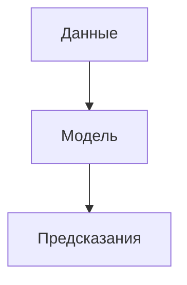
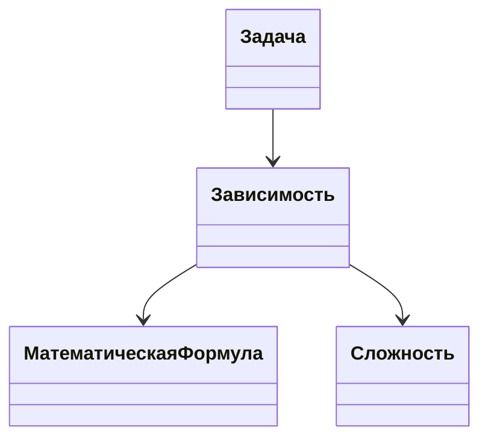
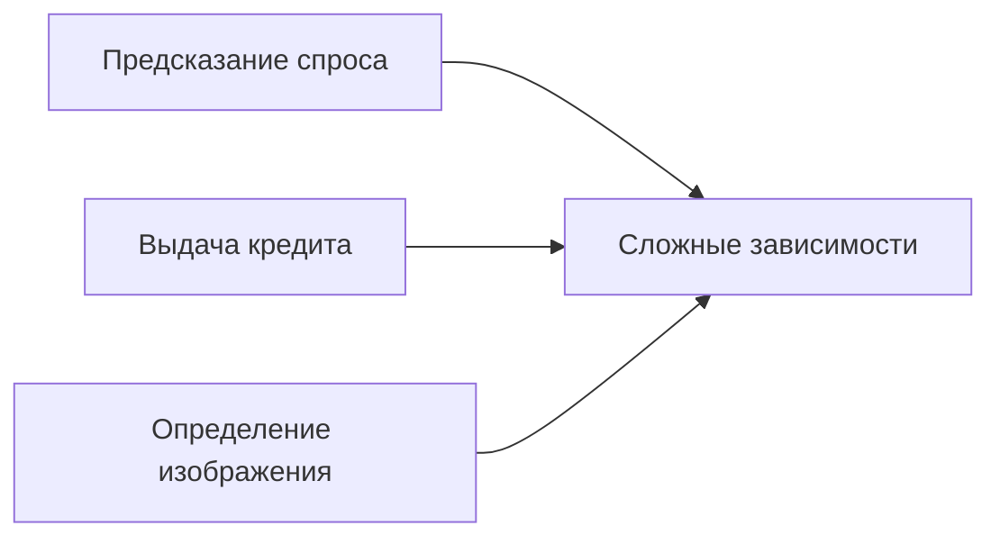
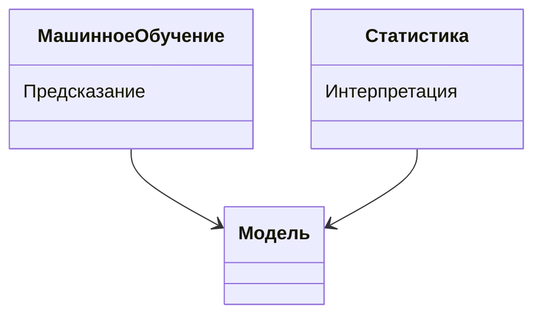

# Введение в машинное обучение

**Машинное обучение** — это дисциплина, изучающая построение моделей, которые позволяют компьютерам выявлять зависимости в данных без их непосредственного программирования.

## Определение и основные принципы

В машинном обучении модель обучается на определённой выборке данных, запоминая зависимости, чтобы затем делать предсказания на новых данных.

### Зависимости в машинном обучении

Зависимости могут быть сформулированы словесно, например:
- площадь прямоугольника — это произведение длины на ширину;
- вероятность выжить на «Титанике» зависит от пола пассажира.

Однако модели лучше работают с математическими формулами. Пример зависимости, выраженной в виде математической формулы: перевод массы из тонн в килограммы (масса в тоннах * 1000).

  
  

*Диаграмма выше иллюстрирует базовый процесс машинного обучения: данные используются для обучения модели, которая затем делает предсказания.*

## Сложности формулирования зависимостей

Не всегда возможно перевести зависимость в чёткое математическое выражение. Например, для прогнозирования погоды необходимо учитывать множество факторов, что делает задачу сложной для формулирования в виде уравнения.

  

Другой пример — определение эмоциональной окраски текста. Как формулировать соответствующую зависимость и подавать фрагмент текста в модель? Это также остаётся неясным.

  

*Диаграмма показывает, что задачи машинного обучения могут иметь зависимости, которые либо выражаются математически, либо остаются сложными для формализации.*

## Примеры сложных задач

Существуют и другие сложные вопросы, такие как:
- предсказание спроса в следующем месяце;
- определение, следует ли выдавать клиенту кредит;
- определение того, что изображено на фотографии.

Для всех этих вопросов сложно формулировать чёткие математические зависимости, а в некоторых случаях это невозможно.

  
  

*Диаграмма иллюстрирует, что сложные задачи машинного обучения часто связаны с неочевидными или неформализуемыми зависимостями.*

## Цели машинного обучения

Цель машинного обучения состоит в том, чтобы попытаться приблизить истинные зависимости при помощи какой-нибудь математической модели.

  

*Цель машинного обучения — приблизить истинные зависимости с помощью математической модели.*

## Связь машинного обучения и статистики

Машинное обучение и статистика зачастую работают с общими моделями. Однако статистика использует эти модели для интерпретации и объяснения окружающего мира, в то время как машинное обучение ставит целью предсказать величину или явление.

  

*Диаграмма показывает различия в целях использования моделей в машинном обучении и статистике.*