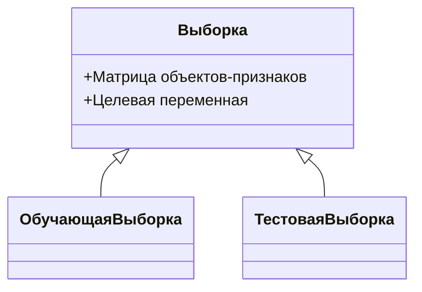

# Основные понятия и обозначения в машинном обучении

## Обозначения и термины

В машинном обучении используются следующие обозначения и термины:

- **Наблюдение (объект)**: обозначается как $X$ и $T$. 
- **Признаковое описание**: объекты записываются в виде $D$-мерных векторов, где $D$ — количество признаков.
- **Матрица объектов-признаков**: матрица, в которой $N$ наблюдений расположены в определённом порядке.
- **Зависимая переменная (ответ, целевая переменная, таргет)**: то, что мы хотим предсказать. Обычно это вектор из $N$ наблюдений. 

## Выборка в машинном обучении

В машинном обучении используются две выборки:

1. **Обучающая выборка**: состоит из матриц объектов-признаков и целевой переменной.
2. **Тестовая выборка**: используется для проверки качества модели после обучения.

## Пример задачи

Рассмотрим пример задачи: открытие новой пиццерии. 

Пусть мы хотим найти такое расположение ресторана, которое принесёт максимальную прибыль. Предположим, что мы собрали выборку из 10 тысяч наблюдений с характеристиками уже работающих пиццерий, такими как удалённость от метро или расстояние до центра города, и прибыль от каждой пиццерии за фиксированный промежуток времени.

В качестве модели выберем линейную регрессионную модель.  Обучим эту модель на обучающей выборке так, чтобы предсказания модели были близки к истинным значениям целевой переменной.

Если у нас есть обученная модель, то для нового предполагаемого расположения прибыль мы можем предсказывать, просто подставив признаковое описание нового расположения в модель. 

## Обучение модели и оценка качества

Для обучения модели используется функция потерь. Для нелинейной регрессии можно использовать средний квадратичную функцию потерь. 

Чтобы проверить качество модели после обучения, используется тестовая выборка. Для расчёта ошибки предсказания модели вводится функция непохожести между предсказаниями модели на тестовой выборке и истинными значениями переменной на тестовой выборке. Такую функцию называют метрикой качества.

Пример метрики качества — средняя абсолютная ошибка.

### Различия между функцией потерь и метрикой качества

Основное различие между функцией потерь и метрикой качества заключается в том, что функция потерь используется при обучении, а метрика качества — для оценки качества модели на новой выборке. 

Метрика качества также может рассчитываться на обучающей выборке для того, чтобы узнать качество подгонки модели.

## Применение процедуры

Описанная процедура подходит для описания большинства задач, даже если из первого взгляда кажется, что это не так. Например, при помощи данной процедуры можно решить задачу определения того, что изображено на картинке, кошка или собака. 

## Диаграммы и схемы

### Процесс обучения модели

*Процесс обучения модели включает в себя использование обучающей выборки для настройки параметров модели с помощью функции потерь и последующую оценку качества модели на тестовой выборке с использованием метрики качества.*

### Классификация выборок

*Классификация выборок в машинном обучении включает обучающую и тестовую выборки, которые используются для обучения и оценки модели соответственно.*