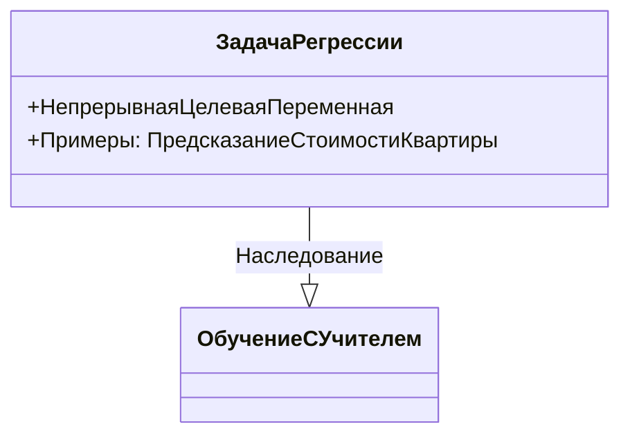
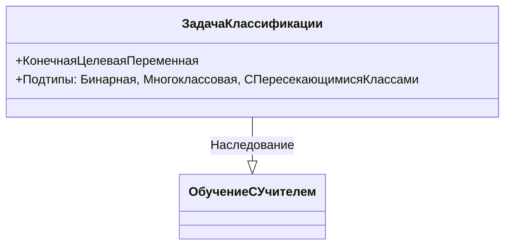
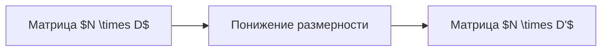
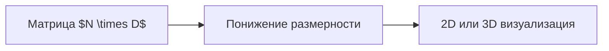

# Классификация задач машинного обучения

Задачи машинного обучения можно разделить на две основные категории по наличию или отсутствию целевой переменной:

1. **Обучение с учителем**: целевая переменная присутствует.
2. **Обучение без учителя**: целевая переменная отсутствует.

## Обучение с учителем

### Задача регрессии

- Целевая переменная присутствует и является непрерывной или вещественной, может принимать произвольное значение из какого-либо интервала.
- Пример: предсказание стоимости квартиры по её площади.
- Регрессия может быть не только линейной, существует множество моделей для решения этой задачи.

  
  

### Задача классификации

- Целевая переменная принимает лишь конечное число значений.
- Подтипы задач классификации:
  - **Бинарная классификация**: целевая переменная принимает всего два значения, например, -1 и 1 или 0 и 1.
  - **Многоклассовая классификация**: целевая переменная может принимать одно из нескольких значений, больше двух.
  - **Классификация с пересекающимися классами**: целевая переменная может принимать подмножество значений из фиксированного множества.

  
  

### Задача ранжирования

- Пусть у нас есть набор из N документов $D_1...D_N$ и некоторый запрос. Мы хотим отсортировать документы в соответствии с релевантностью этому запросу.
- Алгоритм должен выдавать оценку релевантности.
- В зависимости от формулировки задачи, данную задачу можно свести либо к задаче классификации, либо к задаче регрессии.

  

## Обучение без учителя

### Задача кластеризации

- Задача кластеризации формулируется следующим образом: есть только матрица объекты-признаки $X$, целевая переменная $Y$ отсутствует.
- Используя только характеристики объектов в матрице объекты-признаки, необходимо выделить группы похожих объектов.
- Пример: сегментация покупателей в торговой сети.

  

### Задача понижения размерности

- Предположим, что матрица объекты-признаки имеет размеры $N \times D$, где $D$ очень большое, возможно, даже больше, чем $N$.
- Такие матрицы возникают в различных химических или медицинских измерениях.
- Формально, мы заинтересованы в поиске матрицы $X'$ размера $N \times D'$, где количество наблюдений такое же, как в исходной матрице, а количество признаков гораздо меньше.

  

### Задача визуализации

- Частный случай задачи понижения размерности, когда мы хотим понизить размерность до 2 или 3, чтобы было удобно изобразить выборку в 2-мерной или 3-мерной плоскости.

  