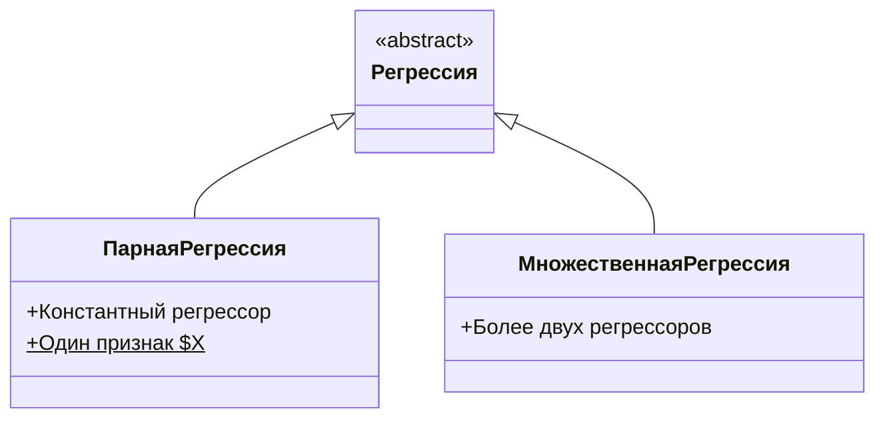
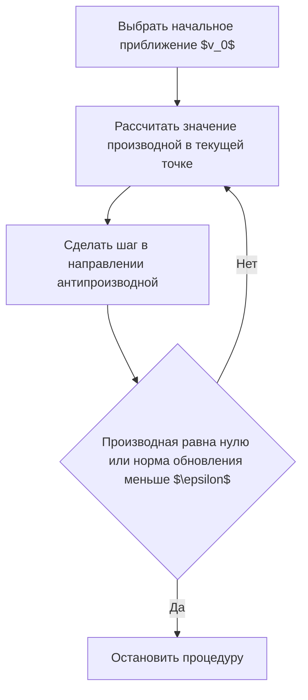
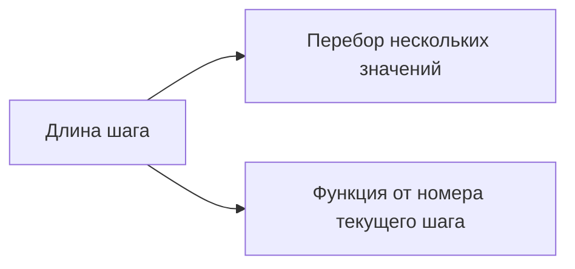

# Обучение модели линейной регрессии в контексте машинного обучения

## Постановка задачи

Дано:
- Обучающая выборка данных $(X, Y)$, где $X$ — признаки объектов, $Y$ — целевая переменная, принимающая вещественные значения из некоторого интервала.

Цель:
- Построение линейной модели, представляющей собой линейную комбинацию весов $V$ и признаков $X$.

## Классификация моделей

Линейные модели регрессии можно классифицировать следующим образом:



- **Парная регрессия**: модель с двумя регрессорами (константным и одним признаком $X$).
- **Множественная регрессия**: модель с более чем двумя регрессорами.

## Параметры модели

Веса или коэффициенты $V$ и $T$ являются параметрами модели, которые подбираются в процессе обучения.

## Линейность по весам

Линейная регрессия линейна по весам, что позволяет накладывать произвольные нелинейные преобразования на целевую переменную и признаки.

## Обучение линейной регрессии

### Выбор функции потерь

Для обучения линейной регрессии выбирается функция потерь, отражающая невязку между истинными значениями целевой переменной и предсказаниями модели.

#### Виды функций потерь

```mermaid
graph LR
    A[Функции потерь] --> B[Среднеквадратичная функция потерь (MSE)]
    A --> C[Средняя абсолютная ошибка (MAE)]
```

- **Среднеквадратичная функция потерь (Mean Squared Error, MSE)**: усреднённая сумма квадратов остатков.
- **Средняя абсолютная ошибка (Mean Absolute Error, MAE)**: усреднённая сумма модулей разностей между значениями целевой переменной и предсказаниями модели.

### Подбор параметров

Для подбора параметров модели (весов) минимизируется функция потерь по неизвестным параметрам.

#### Пример с MSE

Для случая парной регрессии используются простые формулы для вычисления весов. Для множественной регрессии минимизация функции потерь по $d+1$ коэффициенту требует решения системы уравнений.

## Матричная нотация

Для упрощения задачи и адаптации её для работы на компьютерах используется матричная нотация. Модель представляется в виде произведения матрицы объектов-признаков на вектор весов.

### Векторное представление

- Матрица $X$ имеет размерность $n \times (d+1)$.
- Вектор $V$ имеет размерность $(d+1) \times 1$.

#### Евклидова норма вектора

$\|y - Xv\|^2$ — квадрат нормы разности между вектором $y$ и вектором $Xv$.

## Градиентный спуск

Численный метод решения задачи минимизации средней квадратичной ошибки.

### Идея градиентного спуска

- Производная функции в точке экстремума равна нулю.
- Производная показывает направление наискорейшего возрастания функции.

#### Алгоритм градиентного спуска



1. Выбрать начальное приближение $v_0$.
2. Повторять процедуру несколько раз:
   - Рассчитать значение производной в текущей точке.
   - Сделать шаг в направлении антипроизводной.
3. Остановить процедуру, когда производная в очередной точке равна нулю или норма очередного обновления меньше фиксированного маленького числа $\epsilon$.

### Проблемы градиентного спуска

- Нахождение только локального минимума.
- Решение проблемы — multi-start, то есть запуск градиентного спуска из нескольких случайных начальных точек.

#### Длина шага

Длина шага — положительная величина, контролирующая скорость обучения. Оптимальное значение длины шага подбирается внешней процедурой.

##### Вариации длины шага



- Перебор нескольких значений длины шага и запуск градиентного спуска для каждого значения.
- Установление длины шага как функции от номера текущего шага.


