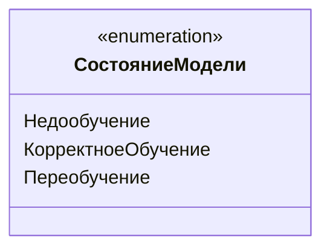
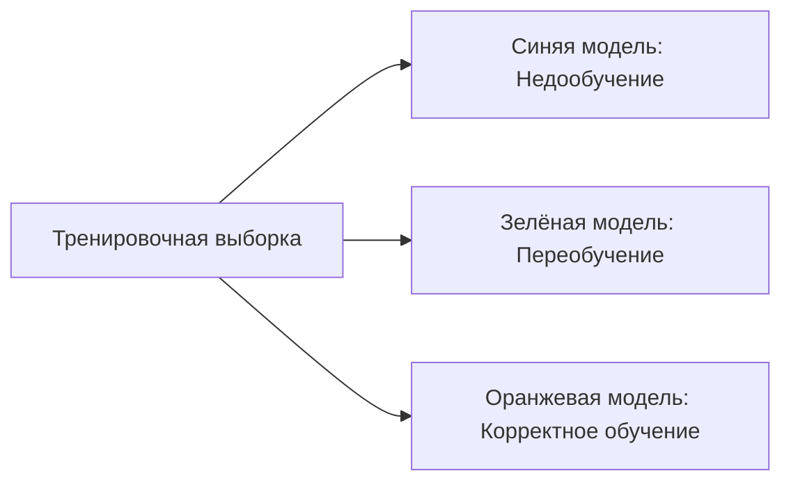

# Переобучение моделей в машинном обучении и методы борьбы с ним

## Обобщающая способность модели

**Обобщающая способность** — это способность модели давать корректные предсказания на данных, которые не участвовали в обучении.

В соответствии с обобщающей способностью модель может находиться в трёх состояниях:

* **Недообучение**
* **Корректное обучение**
* **Переобучение**

### Недообучение

**Недообучение** — это ситуация, когда модель не смогла правильно запомнить зависимость на обучающей выборке. В этом случае мы будем наблюдать низкое качество как на обучающей, так и на тестовой выборках. 

### Корректное обучение

**Корректное обучение** — это ситуация, к которой мы стремимся. Модель выучила зависимости в обучающей выборке, но при этом не подогналась под неё. Такая модель будет давать приемлемое качество на обучающей и тестовой выборках.

### Переобучение

**Переобучение** — это ситуация, когда модель идеально запомнила свойство обучающей выборки, при этом не выучив общие зависимости в ней. В этом случае мы будем наблюдать низкое качество на новых данных, но высокое или идеальное качество на обучающей выборке. 

Графические ситуации недообучения, корректного обучения и переобучения можно изобразить следующим образом: 

## Переобучение в линейной регрессии

Эмпирически, то есть на практике, было обнаружено следующее: при переобучении в линейной модели получаются довольно большие оценки весов. 

### Регуляризация

Раз большие веса свидетельствуют о переобучении, введём следующую идею: давайте будем штрафовать большие веса. Идея вводить штраф на большие веса получила название **регуляризация**. 

Процедура такая: добавим функции потерь дополнительную функцию, которую мы будем называть регуляризатором. В качестве регуляризатора можно использовать, например, евклидову норму весов или сумму модулей весов.

## Метрики качества в линейной регрессии

В заключение поговорим про метрики, которые используются в машинном обучении для оценки качества предсказаний линейной регрессии на новых данных. Оказывается, что используются все те же метрики, которые были в статистике: средний квадратичный ошибка, средний абсолютно ошибка, коэффициент детерминации и другие. 