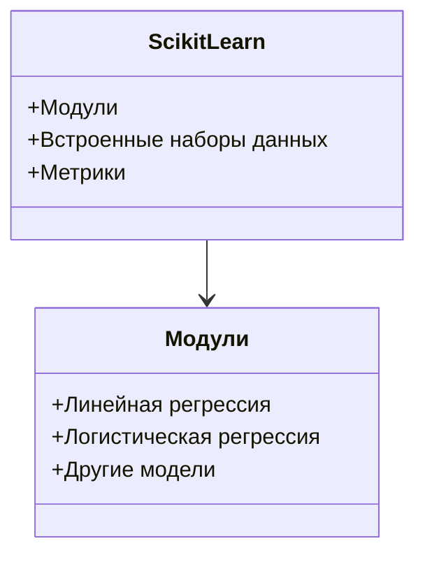
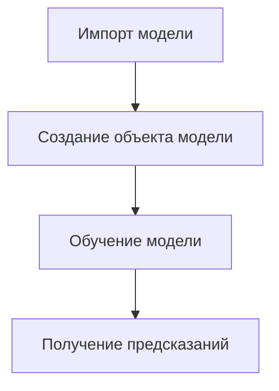

# Обучение линейной регрессии с использованием библиотеки Scikit-learn

## Введение

**Scikit-learn** — одна из наиболее популярных библиотек для обучения моделей машинного обучения на языке Python. Она предоставляет широкий спектр инструментов для решения различных задач, включая регрессию и классификацию.

## Основные компоненты Scikit-learn

### Модули

В Scikit-learn есть модули, содержащие различные модели машинного обучения:

- **Линейная регрессия**
- **Логистическая регрессия**
- Другие модели



### Встроенные наборы данных

Scikit-learn предоставляет большое количество встроенных наборов данных, с которыми можно работать. Они находятся в модуле **sklearn.datasets**.

### Метрики

В библиотеке реализованы различные метрики, используемые для оценки качества моделей машинного обучения. Например, среднеквадратичная ошибка (MSE) и средняя абсолютная ошибка (MAE).

## Пример использования Scikit-learn для обучения линейной регрессии

### Шаг 1. Подгрузка данных

Для решения задачи регрессии можно использовать набор данных с ценами на дома в Калифорнии. Датасеты в Scikit-learn подгружаются следующим образом:

```python
from sklearn.datasets import fetch_california_housing
```

Набор данных **fetch_california_housing** представляет собой функцию, которая возвращает словарь с ключами **data** (данные), **target** (целевая переменная) и другими полями.


### Шаг 2. Обучение модели и получение предсказаний

#### Импорт модели

Первым делом необходимо импортировать модель, которую мы хотим обучить. В данном случае из модуля **sklearn.linear_model** мы импортируем класс **LinearRegression**:

```python
from sklearn.linear_model import LinearRegression
```

#### Создание объекта модели

Затем мы создаём объект этого класса, инициализируя модель:

```python
model = LinearRegression()
```

При инициализации можно устанавливать различные параметры. Например, можно попросить модель не включать свободный член, установив значение параметра **fit_intercept** как **False**.


#### Обучение модели

Для обучения модели требуется вызвать у осознанной переменной метод **fit**, передав в него данные, на которых мы хотим обучить модель:

```python
model.fit(X_train, y_train)
```

#### Получение предсказаний

Для получения предсказаний используется метод **predict**. Внутрь этого метода подаётся выборка, на которой мы хотим получить предсказание:

```python
predictions = model.predict(X_test)
```



### Шаг 3. Оценка качества

В качестве метрик качества будем использовать среднеквадратичную ошибку (MSE) и среднюю абсолютную ошибку (MAE). Они хранятся в модуле **sklearn.metrics**, из которого мы импортируем **mean_squared_error** и **mean_absolute_error**:

```python
from sklearn.metrics import mean_squared_error, mean_absolute_error
```

Для функций **mean_squared_error** и **mean_absolute_error**, как и для прочих метрик качества в Scikit-learn, предусмотрен унифицированный интерфейс. Первая переменная, которая подаётся внутрь этих метрик, — это истинное значение целевой переменной, а вторая — предсказанное значение переменной.

