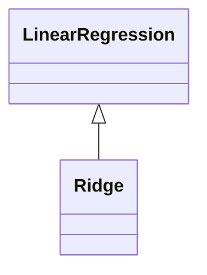

# Обучение линейной регрессии

## Шаг 4: Обучение новой модели

### Добавление квадратичных признаков

Для улучшения качества модели линейной регрессии добавим в обучающую и тестовую выборки квадраты признаков.

1. Создадим новую переменную `extrain_sq` и соединим её с матрицей `extrain` при помощи `np.hstack`.
2. Аналогично поступим с тестовой выборкой.

Важно отметить, что для тестирования качества в `extrain_test` должно быть одинаковое количество признаков. Если мы совершаем какое-то преобразование над `extrain`, то мы должны совершить такое же преобразование и над `extest`.

### Обучение модели

Создадим новый объект класса линейной регрессии, который назовём `LR2`.

Обучим `LR2` на `extrain_sq` и `y_train`. Заметим, что изменение матрицы `X` никак не повлияло на изменение целевой переменной.

Сделаем предсказание на обучающей и тестовой выборках.

## Оценка качества модели

Рассчитаем среднюю абсолютную ошибку между `y_train` и предсказаниями на выборке с квадратами.

Для новой модели `MSE` на трейне получается 0.5, на тесте — тоже примерно 0.5, `MAE` на трейне 0.52, `MAE` на тесте 0.52. Заметим, что в каждом случае как `MSE`, так и `MAE` у новой модели меньше по сравнению с предыдущей моделью. Это означает, что новая модель с 16 признаками более корректно подстраивается под зависимости в обучающей выборке.

## Шаг 5: Переобученная модель

### Создание переобученной модели

Одним из способов получить переобученную модель является равенство между количеством признаков и количеством наблюдений.

Построим новую матрицу `X_train_short`, которая будет являться матрицей `X_train_square` из предыдущего пункта, но состоящей из первых 16 наблюдений.

Создадим очередную модель, которую назовём `LR3`, и обучим её на новых данных.

Сделаем предсказание на обучающей и тестовой выборках.

Рассчитаем метрики качества для этой новой модели.

Заметим, что ошибка на обучающей выборке, измеренная как по `MSE`, так и по `MAE`, равна 0, потому что модель идеально подогналась под данные. Можно сказать, что линия регрессии проходит идеально через все 16 точек. На тестовой выборке ошибки огромные.

## Шаг 6: Регуляризация

### Использование регуляризации

Для использования линейной регрессии с регуляризацией требуется импортировать отдельную модель. Находится она в модуле `sklearn.linear_model` и называется `Ridge`.

`Ridge` — это регуляризация с использованием суммы квадратов весов в качестве регуляризатора. В `sklearn.linear_model` также содержатся и другие модели, реализующие другие стратегии регуляризации.

Обучение `Ridge` модели, то есть модели с L2 регуляризатором, точно такое же, как было для предыдущих моделей.

Создадим переменную `LR_rek` и это `Ridge` регрессия. При инициализации можно указать силу регуляризации, выражающуюся в коэффициенте `alpha`. По умолчанию коэффициент `alpha` равен 1.

Обучим регуляризованную модель на той же выборке, на `X_train_short` и `y_train_short`. Получим предсказание на тренировочной и тестовой выборках.

И посмотрим на метрики качества для этой модели с регуляризацией.

Заметим, что ошибки на тренировочной выборке больше не равны 0, а ошибки на тестовой выборке, хотя всё ещё довольно большие, но меньше, чем были в полностью переобученной модели. Таким образом, регуляризация действительно помогла победить проблему переобучения.

