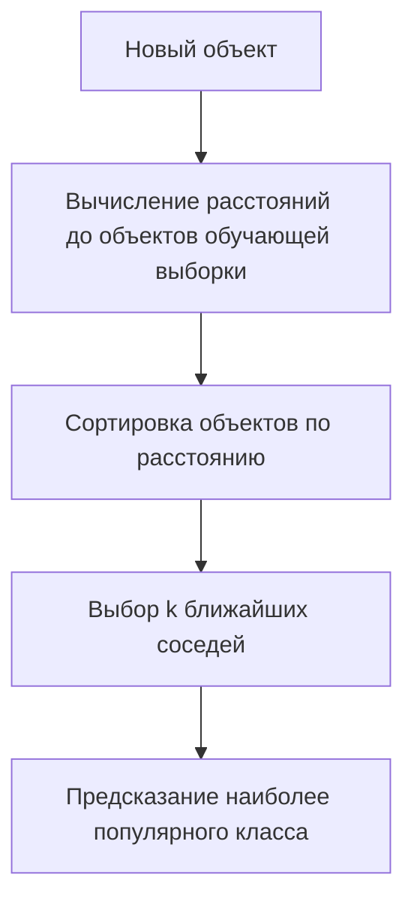
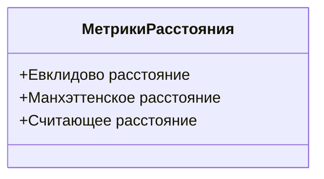

# Задача классификации и метод k-ближайших соседей

## Постановка задачи классификации

В этой лекции мы рассмотрим задачу классификации и два метода её решения, а также используемые в этой задаче метрики. Начнём с метода k-ближайших соседей, который относится к метрическим методам, то есть к методам, основанным на расстояниях.

Пусть у нас есть обучающая выборка, матрица «объекты — признаки» $X$ и целевая переменная $Y$, вектор $n \times 1$. Будем решать задачу *многоклассовой классификации*, то есть каждая наблюдение может относиться к одному из нескольких классов. Заметим, что мы также можем решать задачу *бинарной классификации*, то есть каждая наблюдение может относиться к одному из двух классов.

## Метод k-ближайших соседей

### Принцип работы

Метод k-ближайших соседей основан на *гипотезе компактности*: у похожих друг на друга объектов будут похожие ответы. В данном случае нам нужно формально определить понятие похожести. Метод k-ближайших соседей, как и прочие метрические методы, определяет похожесть как некоторое расстояние между объектами.

В качестве расстояния можно взять, например, евклидово расстояние между объектами. Однако евклидово расстояние не подойдёт для категориальных признаков, но пока предположим, что все признаки числовые и позволяют рассчитывать евклидово расстояние между ними.

На этапе обучения метод k-ближайших соседей запоминает обучающую выборку. На этапе предсказания, когда к нам поступает новый объект, метод k-ближайших соседей сортирует объекты обучающей выборки, которую он запомнил на предыдущем шаге, по расстоянию до нового объекта. Затем мы предсказываем наиболее популярный класс среди k ближайших соседей, где k мы выбираем самостоятельно.

Рассмотрим пример. На данной картинке изображена заполненная обучающая выборка с тремя классами: синим, красным и зелёным. Новый объект обозначен оранжевой звёздочкой. Какой класс будет предсказан для нового объекта при k = 2, то есть при двух ближайших соседях? Можно заметить, что наиболее близки к звёздочке две синие точки. Соответственно, предсказанный класс будет синим.

Другой пример. Что, если мы разместим звёздочку ближе к правой части слайда, в группе из пяти точек? И будем всё ещё применять метод k ближайших соседей с двумя ближайшими соседями. В данном случае мы видим, что две ближайшие точки к звёздочке относятся к зелёному классу, а значит, предсказан будет зелёный класс. Заметим, что если мы используем метод k ближайших соседей с пятью ближайшими соседями, то предсказанный класс будет синим, потому что среди пяти ближайших соседей синий класс преобладает.

### Метрики расстояния

Для числовых признаков мы можем использовать евклидово расстояние. Другой популярный пример расстояния — это манхэттенское расстояние, которое представляет собой сумму модулей между объектами. Название этой метрики получило в честь района Манхэттен в городе Нью-Йорке. Дело в том, что улицы в нём перпендикулярны друг другу, поэтому если вы хотите найти расстояние между двумя точками в этом районе, двигаясь из одной точки до другой на такси, то использовать манхэттенское расстояние будет наиболее разумным образом.

Для категориальных признаков можно использовать различные метрики расстояния. Например, такую метрику называется считающим расстоянием, и это просто сумма несовпадений между значениями объектов.

### Обобщение

Метод k-ближайших соседей достаточно прост и основан на расчётах расстояний. Метод настолько прост, что на этапе обучения даже не происходит минимизации какой-либо функции, а лишь запоминание обучающей выборки. У этого метода есть два гиперпараметра: число соседей k и функция расстояния. Напомню, что гиперпараметры мы задаём извне самостоятельно. Их подбор не происходит на этапе обучения.

Несмотря на простоту этого метода, если на данных выполняется гипотеза компактности, метод может показывать довольно хорошие результаты при предсказаниях на новых данных. Проблема этого метода заключается в том, что поиск соседей на больших выборках может занимать довольно долгое время. Современные исследования направлены на разработку алгоритмов для быстрого поиска соседей.