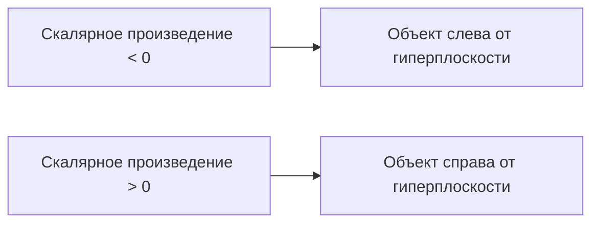
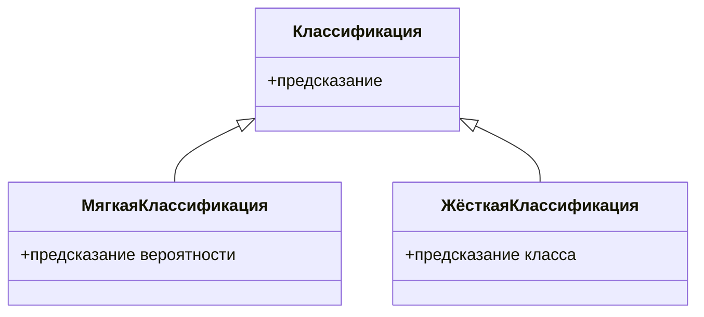

# Логистическая регрессия в машинном обучении

## Постановка задачи

Рассмотрим задачу бинарной классификации с использованием модели логистической регрессии. Дана обучающая выборка $(X, Y)$, где $X$ — объекты-признаки, а $Y$ — целевая переменная.

## Адаптация линейной регрессии

Для решения задачи бинарной классификации можно адаптировать метод линейной регрессии. Запишем линейную модель в виде скалярного произведения:

Уравнение задаёт гиперплоскость в некотором пространстве. Гиперплоскость — это аналог прямой в пространстве размерности больше чем 2.

Если скалярное произведение меньше 0, то объект находится слева от гиперплоскости (синие объекты). Если скалярное произведение больше 0, то объект находится справа от гиперплоскости (красные объекты).

## Понятие отступа

Расстояние от точки до гиперплоскости можно посчитать при помощи следующего выражения:

$\text{расстояние} = \frac{|\text{скалярное произведение}|}{\text{некоторое положительное число}}$

Чем больше скалярное произведение, тем больше расстояние от точки до гиперплоскости. Это интерпретируется следующим образом: чем больше скалярное произведение, тем более уверенный ответ классификатора.

**Отступ** — это произведение целевой переменной на значение скалярного произведения. Отступ будет положительным только в случае, если классификатор даёт верный ответ.

## Функция потерь

Попробуем построить функцию потерь, основанную на отступе. Наивным образом это можно сделать так:

Запишем функцию потерь как сумму индикаторов того, что модель ошибается, а именно, что знак скалярного произведения не соответствует значению целевой переменной. Если мы хотим переписать функцию потерь в виде отступа, то функция потерь будет выглядеть как сумма индикаторов того, что отступ меньше 0.

Однако у этой функции потерь есть существенный недостаток: она не дифференцируема. Решение, которое часто используется в машинном обучении, — оценить такую недифференцируемую функцию потерь другой, дифференцируемой функцией, и минимизировать так называемую верхнюю оценку на функцию потерь.

## Логистическая функция потерь

Логистическая регрессия использует логистическую функцию потерь, которая выглядит следующим образом:

Используя логистическую функцию потерь, задачу можно переписать так, как указано на слайде. Так как данная функция потерь является дифференцируемой, то такую задачу мы уже решать умеем. Можно просто запустить на ней градиентный спуск.

Для логистической функции потерь градиенты выглядят следующим образом, а значит, процедура градиентного спуска позволит сойти к нам к локальному минимуму.

## Мягкая и жёсткая классификация

В статистике логистическая регрессия предсказывала вероятности, а здесь мы строим предсказание модели как знак скалярного произведения. Скалярное произведение плохо подходит для предсказания вероятностей, просто потому что оно может выдавать число больше, чем единица или меньше, чем ноль.

Попробуем решить эту проблему следующим образом: возьмём выход модели в функцию, которая выдаёт число от 0 до 1. В данном случае в качестве такой функции можно использовать сигмоид.

Можно показать, что функция потерь, которую мы рассматривали до этого, эквивалентна следующей функции потерь, которая записывается через сигмоид, а значит, обучая модель на скалярное произведение, мы обучаем её и направленному предсказанию вероятностей.

Предсказание вероятности в машинном обучении выделяется в отдельный класс задач, который называется мягкой классификацией. При решении задачи мягкой классификации мы предсказываем вероятность принадлежности классу. При решении задачи жёсткой классификации мы предсказываем сам класс. Заметим, что мы всегда можем перейти от задачи мягкой классификации к задаче жёсткой классификации, просто установив некоторые порог на вероятность, а вот обратный переход либо невозможен, либо достаточно сложен.

Диаграмма выше иллюстрирует взаимосвязь между мягкой и жёсткой классификацией, где обе являются подклассами общей классификации.