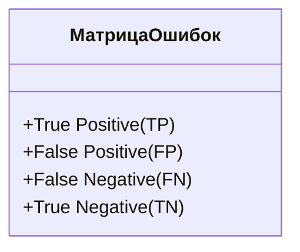
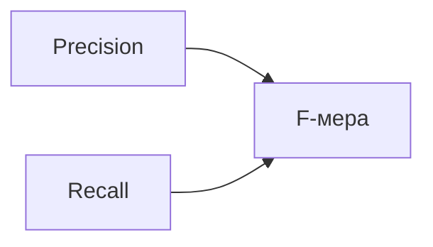

# Метрики качества в задаче классификации

## Доля правильных ответов (Accuracy)

**Accuracy** — это сумма индикаторов того, что модель предсказала правильный класс, делённая на количество наблюдений.

Эта метрика проста и хорошо интерпретируема. Однако у неё есть существенный недостаток — она неустойчива к дисбалансу классов.

**Пример:**
- Пусть мы заинтересованы в предсказании того, болен пациент или нет.
- Предположим, что в тестовой выборке 99 пациентов не больны и 1 пациент болен, то есть выборка сильно не сбалансирована в сторону одного из классов.
- В этом случае модель, которая предсказывает, что все пациенты здоровы, будет иметь Accuracy 99%. Однако данная модель не является хорошей.

## Матрица ошибок

Для решения проблемы неустойчивости Accuracy к дисбалансу классов предлагается использовать другие метрики, которые были бы устойчивы к этому дисбалансу. Для того чтобы рассмотреть эти метрики, обсудим понятие матрицы ошибок.

Матрица ошибок для бинарной классификации выглядит следующим образом:
- По строкам откладываются предсказания алгоритма (1 или –1).
- По столбцам откладываются истинные значения целевой переменной.

**Термины:**
- **True Positive (TP)** — алгоритм предсказывает положительный класс, и целевая переменная действительно положительна.
- **False Positive (FP)** — алгоритм предсказывает положительный класс, но целевая переменная отрицательна.
- **False Negative (FN)** — алгоритм предсказывает отрицательный класс, но целевая переменная положительна.
- **True Negative (TN)** — алгоритм правильно предсказывает отрицательный класс.

*Матрица ошибок позволяет наглядно представить, как модель классифицирует данные, разделяя их на правильные и ошибочные предсказания.*

## Другие метрики

### Precision (точность)

Precision считается как TP, делённая на сумму TP и FP. Это означает, что мы делим количество правильно предсказанных объектов положительного класса на общее количество объектов, которую модель отнесла к положительному классу.

Эту метрику можно интерпретировать так: насколько можно доверять классификатору, когда классификатор предсказывает положительный класс.

### Recall (полнота)

Полнота — это отношение TP к сумме TP и FN. То есть отношение количества правильно предсказанных объектов положительного класса к общему количеству объектов положительного класса.

Это можно интерпретировать как долю объектов положительного класса, которую смог найти наш классификатор.

Выбор между Precision и Recall решается из практических соображений, на основе мнения заказчика.

### F-мера

F-мера представляет собой среднее между Precision и Recall. Если у нас нет цели оптимизировать отдельно Precision или Recall, то F-мера даст неплохую оценку качества по обоим показателям.

*F-мера объединяет Precision и Recall, предоставляя сбалансированную оценку качества модели.*

