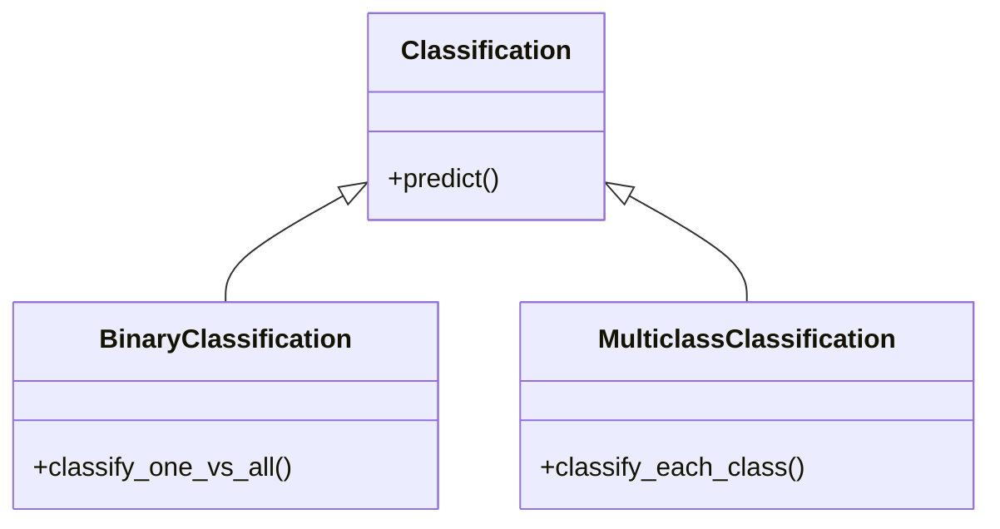
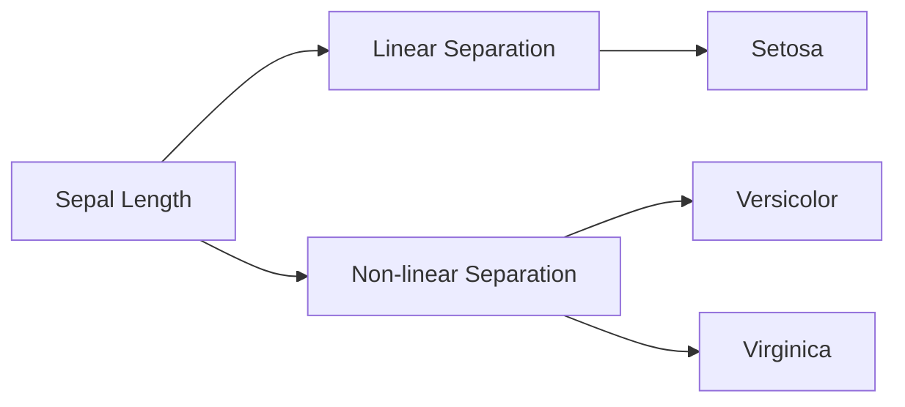
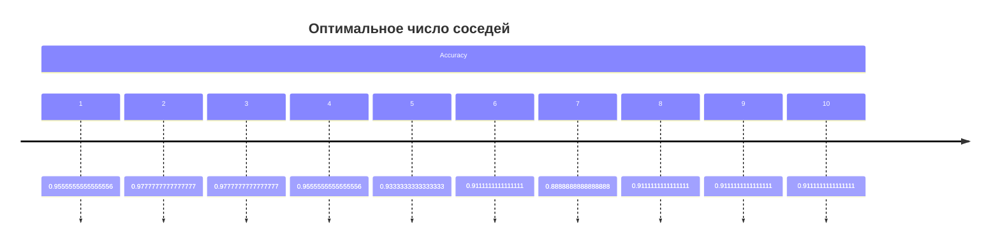

# Классификация и метод k ближайших соседей (k-NN)

## Импорт данных

Для демонстрации метода k-NN используется датасет «Ирис Фишера», доступный в `sklearn.datasets`.

```python
from sklearn.datasets import load_iris
iris = load_iris()
```


## Подготовка данных

### Разделение на признаки и целевую переменную

```python
X = iris.data
y = iris.target
```


### Преобразование в DataFrame

```python
import pandas as pd
X = pd.DataFrame(X, columns=iris.feature_names)
```

### Описание данных

Набор данных содержит 150 наблюдений над цветками «Ириса». Каждое наблюдение кодируется 4 переменными:

- `Sepal Length` (длина чашелистика);
- `Sepal Width` (ширина чашелистика);
- `Petal Length` (длина лепестка);
- `Petal Width` (ширина лепестка).

Целевая переменная принимает три уникальных значения: 0, 1 и 2, соответствующих трём разным видам «Ириса».


### Кодирование видов

```python
print(iris.target_names)  # ['setosa', 'versicolor', 'virginica']
```


## Задачи классификации

Можно решать как задачу бинарной классификации (классифицировать цветок одного вида против всех других), так и задачу многоклассовой классификации (классифицировать каждый класс цветка по отдельности).



*Диаграмма показывает иерархию задач классификации: бинарная и многоклассовая классификация.*

## Геометрия данных

Построим диаграмму рассеяния для двух признаков: `Sepal Length` и `Sepal Width`.

```python
import matplotlib.pyplot as plt
plt.scatter(X['sepal length (cm)'], X['sepal width (cm)'], c=y)
plt.xlabel('Sepal Length')
plt.ylabel('Sepal Width')
plt.show()
```

Видно, что выборка имеет следующую особенность: один вид цветка линейно отделим от двух других, а два других вида цветка — линейно неразделимы.




*Диаграмма показывает геометрические особенности данных: линейная и нелинейная разделимость классов.*

## Разделение на обучающую и тестовую выборки

```python
from sklearn.model_selection import train_test_split
X_train, X_test, y_train, y_test = train_test_split(X, y, test_size=0.3, random_state=42)
```

## Масштабирование данных

KNN, как и другие метрические методы, требует масштабирования данных, так как расстояние между объектами зависит от их единиц измерения.

```python
from sklearn.preprocessing import StandardScaler
scaler = StandardScaler()
X_train_scaled = scaler.fit_transform(X_train)
X_test_scaled = scaler.transform(X_test)
```


*Диаграмма показывает процесс масштабирования данных перед использованием метода k-NN.*

## Обучение модели KNN

```python
from sklearn.neighbors import KNeighborsClassifier
knn = KNeighborsClassifier(n_neighbors=5)
knn.fit(X_train_scaled, y_train)
```

## Получение предсказаний

```python
y_pred = knn.predict(X_test_scaled)
```

## Оценка качества

Используем долю правильных ответов (accuracy) для оценки качества модели.

```python
from sklearn.metrics import accuracy_score
accuracy = accuracy_score(y_test, y_pred)
print(accuracy)  # 0.93
```


## Подбор числа соседей

Переберём значения от 1 до 10 и найдём оптимальное число соседей.

```python
accuracies = []
for n_neighbors in range(1, 11):
    knn = KNeighborsClassifier(n_neighbors=n_neighbors)
    knn.fit(X_train_scaled, y_train)
    y_pred = knn.predict(X_test_scaled)
    accuracy = accuracy_score(y_test, y_pred)
    accuracies.append(accuracy)
print(accuracies)  # [0.9555555555555556, 0.9777777777777777, 0.9777777777777777, 0.9555555555555556, 0.9333333333333333, 0.9111111111111111, 0.8888888888888888, 0.9111111111111111, 0.9111111111111111, 0.9111111111111111]
```

Наибольшее значение accuracy даёт число соседей 1 и 5.




*Диаграмма показывает значения accuracy для разных значений числа соседей.*