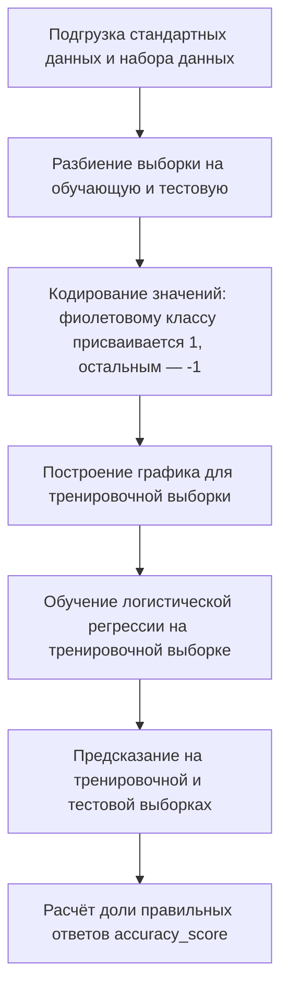
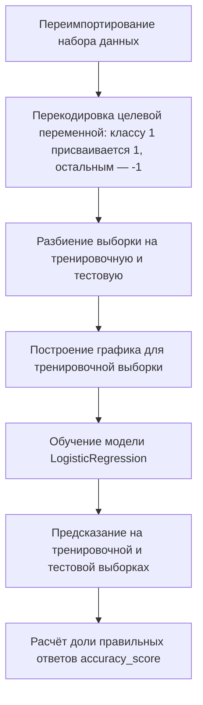
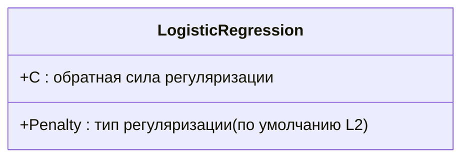

# Реализация модели логистической регрессии в Scikit-Learn

## Постановка задачи

Логистическая регрессия применяется для решения задач бинарной классификации. В данном случае рассматривается её применение для классификации данных в линейно разделимом и линейно неразделимом случаях.

### Линейно разделимый случай

Логистическая регрессия находится в модуле `Scikit-Learn linear model`. Для её использования импортируется `LogisticRegression`, интерфейс которой полностью соответствует интерфейсу `LinearRegression`.

В линейно разделимом случае значение `accuracy_score` как на обучающей, так и на тестовой выборках равно 1, что свидетельствует о возможности идеальной классификации наблюдений.

  
  
  

### Линейно неразделимый случай

Для построения выборки в линейно неразделимом случае необходимо перекодировать целевую переменную.

В линейно неразделимом случае `accuracy_score` на тренировочной выборке составляет примерно 0,64, на тестовой — 0,85, что свидетельствует о невозможности достижения максимальной точности классификации.

  
  

## Предсказание вероятности

С помощью логистической регрессии можно решать задачу мягкой классификации, используя метод `predict_proba`. Этот метод позволяет получить предсказание вероятностей принадлежности наблюдения к каждому из классов.

  

## Регуляризация

Стратегия регуляризации в логистической регрессии реализуется при помощи тех же параметров, что и в случае линейной регрессии. Модуль `LogisticRegression` по умолчанию поддерживает регуляризацию. При инициализации модели логистической регрессии можно указать следующие параметры:

- `Penalty` — тип регуляризации (по умолчанию L2).  
- `C` — обратная сила регуляризации (чем больше C, тем менее применима регуляризация).  

  