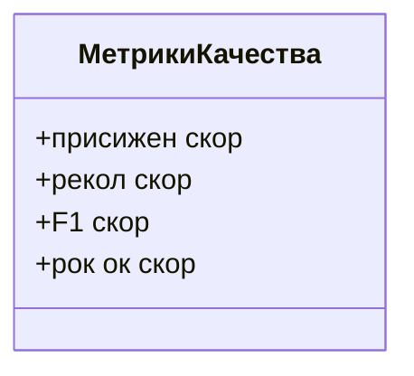
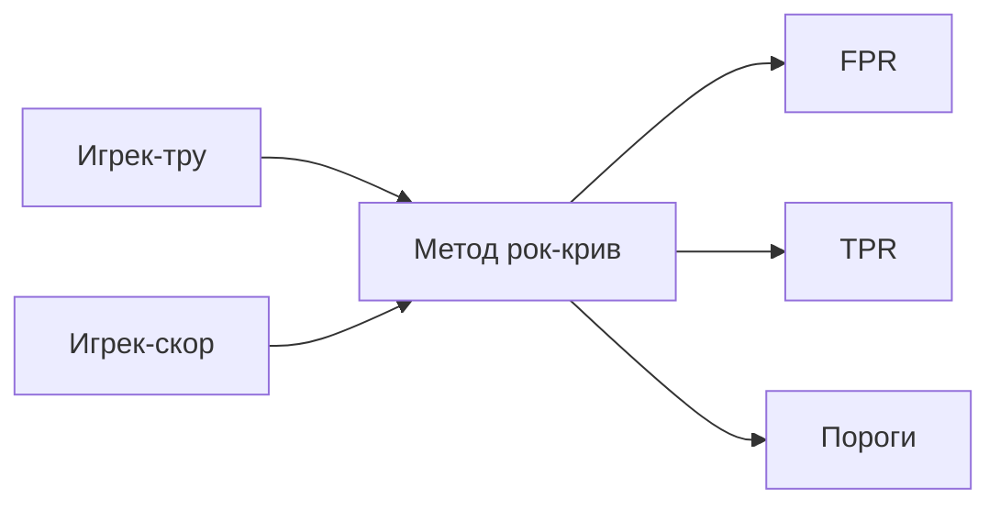

# Метрики качества моделей

## Метрика экеросим и её ограничения

Для оценки качества моделей ранее использовалась метрика экеросим. Однако эту метрику неразумно применять на несбалансированных выборках, где один класс значительно преобладает над другим.

## Другие метрики качества

Рассмотрим другие метрики: присижен, рекол, F1-скор и рок-ок-скор. Они устойчивы к дисбалансу классов и лежат в модуле эскалерный метрикс.

### Классификация метрик

*Примечание: На диаграмме представлены основные метрики качества, используемые для оценки моделей.*

### Расчёт метрик на тестовой выборке

Из эскалерного метрикса импортируем:
* присижен скор;
* рекол-скор;
* F1-скор;
* рок-ок-скор.

Передаём в каждую из метрик Игрек-тру и Игрек-Пред, где:
* Игрек-тру — это истинные значения целевой переменной;
* Игрек-Пред — предсказанная метка.

#### Особенности рок-ок-скор

Обратите внимание, что первый аргумент функции рок-ок-скор — это всё ещё Игрек-тру, а Игрек-скор — это торгец-скорс, то есть предсказанное значение вероятности. В рок-ок-к нам требуется передавать не предсказанные метки, а предсказанное значение вероятности.

Рассчитаем значение этих метрик для тестовой выборки:
* присижен скор между Игрек-тест и Логрек-предикт на х-к;
* рекол-скор для Игрек-теста и Логрек-предикт на х-к;
* F1-скор между теми же переменными;
* рок-ок-скор между Игрек-тестом и предсказанными вероятностями положительного класса.

Получаем:
* присижен скор — 0,64;
* рекол-скор — 0,7;
* F1-скор — 0,67;
* рок-ок-скор — примерно 0,93.

Это говорит о том, что в целом при подборе правильного порога наша логистическая регрессия даёт неплохую классификационную силу.

## Построение рок-кривой

Для построения рок-кривой из эскалерн-метрикс импортируем метод рок-крив. Метод рок-крив принимает значение и грик-ту (истинные лейблы) и грик-скор (предсказанное значение вероятности положительного класса) и выдаёт значение false-positive rate, true-positive rate и значение порогов.

*Примечание: На диаграмме показан процесс построения рок-кривой, где на вход подаются истинные и предсказанные значения, а на выходе получаются FPR, TPR и пороги.*

Получим значение false-positive rate и true-positive rate для задачи классификации на тестовые выборки.

Построим график, соединяющий значение FPR и TPR. FPR будут отложены по оси x, TPR — по оси y.

Добавим диагонали единичного квадрата, то есть дополнительно построим точки 0, 0 и 1 на 1.

Рок-кривая действительно лежит выше диагонали единичного квадрата, то есть в целом наша логистическая регрессия хорошо справляется с классификацией на тестовой выборке. Более того, мы видим, что рок-кривая довольно близко находится к рок-кривой для идеального классификатора, то есть существует точка, которая относительно близко находится к точке 0, 1, а это значит, что для логистической регрессии существует какой-то порог, который будет давать вполне себе хорошие корректные предсказания на тестовой выборке.

