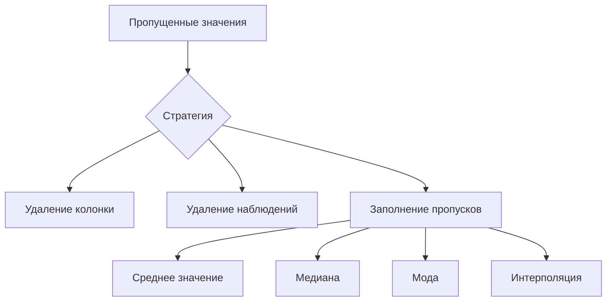

# Работа с пропущенными значениями в Python

## Определение области применения

В данном разделе рассматривается работа с пропущенными значениями в датафреймах при анализе данных с использованием Python.

## Задачи

1. Подсчёт количества пропущенных значений.
2. Фильтрация пропущенных значений.
3. Обсуждение стратегий работы с пропущенными значениями.
4. Перекодирование переменных после заполнения пропущенных значений.

## Инструменты и особенности

### Метод `info`

Для получения общей информации о датафрейме и количестве пропущенных значений используется метод `info`.


Пример использования:
- `info()` отображает общее количество непустых значений в каждой колонке.

### Метод `isna`

Метод `isna` позволяет проверить наличие пропущенных значения в датафрейме.


Пример использования:
- `isna()` возвращает логические переменные, указывающие на наличие пропущенных значений.

### Метод `dropna`

Метод `dropna` используется для удаления наблюдений с пропущенными значениями.


Пример использования:
- `dropna()` удаляет наблюдения с пропущенными значениями.
- Параметр `subset` позволяет указать конкретную колонку для проверки на наличие пропущенных значений.
- Атрибут `inplace` позволяет применить изменения непосредственно к исходному датафрейму.

### Стратегии работы с пропущенными значениями



1. **Удаление колонки:** если в колонке много пропущенных значений, её можно удалить.
2. **Удаление наблюдений:** если пропуски встречаются в небольшом проценте наблюдений, можно удалить эти наблюдения.
3. **Заполнение пропусков:** применяются различные тактики для заполнения пропущенных значений.

## Ограничения

- При использовании `dropna` без указания параметров удаляются все наблюдения с хотя бы одним пропущенным значением.
- Необходимо осторожно использовать атрибут `inplace`, чтобы избежать случайного изменения исходного датафрейма.
```

### Пояснение к диаграмме:
Диаграмма наглядно демонстрирует основные стратегии работы с пропущенными значениями в данных. Она помогает выбрать подходящий метод в зависимости от ситуации.