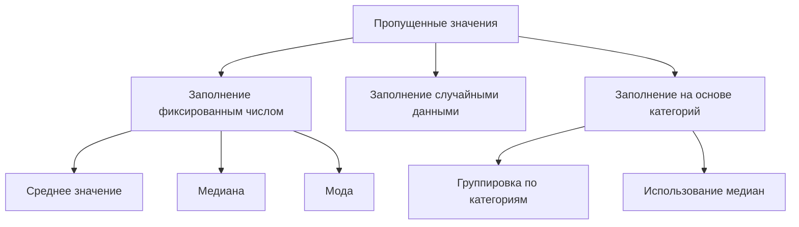

# Стратегии заполнения пропущенных значений в данных

## Основные подходы к заполнению пропусков

Существует несколько стратегий для работы с пропущенными значениями в наборе данных. Рассмотрим основные подходы:

### 1. Заполнение пропусков фиксированным числом
- **Среднее значение, медиана или мода** могут быть использованы как лучшая догадка при отсутствии информации о данных.
- Пример: если неизвестна температура за вчера, но известна средняя месячная температура, можно предположить, что вчерашняя температура была близка к средней.

### 2. Заполнение случайными данными
- Генерация вектора со случайными значениями и использование его для заполнения пропусков.
- Метод `fillna` в *Pandas* может принимать вектор той же размерности, что и оригинальная переменная, и использовать его для поиска и замены пропущенных значений.

### 3. Заполнение на основе категорий
- Группировка данных по категориям (например, по неделям и часам) и использование медианных значений для каждой категории.
- Пример: нахождение медианы температуры для каждого часа каждой недели и использование этих значений для заполнения пропусков.



*Диаграмма иллюстрирует основные подходы к заполнению пропущенных значений.*

## Инструменты и методы

### Метод `fillna` в *Pandas*

Метод `fillna` позволяет заполнить пропущенные значения в *Pandas DataFrame*. Он может работать двумя способами:

- Заполнение фиксированным числом.
- Поиск нужного значения в векторе и подстановка его в пропуски.

Пример использования:

```python
# Заполнение пропусков числом 42
temperatures.fillna(42)
```

### Генерация случайных значений с помощью *NumPy*

Модуль *NumPy* предоставляет возможности для генерации случайных чисел. Пример:

```python
import numpy as np

# Генерация массива случайных значений температуры
temps_random = np.random.choice(temperatures.dropna(), size=len(temperatures))
```

## Ограничения и выводы

Заполнение пропусков имеет свои ограничения. Например, использование медианы может быть неэффективным, если данные имеют сложную структуру или зависят от времени. В таких случаях более подходящими могут быть методы, учитывающие контекст и категории данных.

### Примеры применения

1. **Заполнение пропусков медианой**:
   ```python
   # Заполнение пропусков медианой температуры
   temperatures.fillna(temperatures.median())
   ```

2. **Заполнение пропусков случайными значениями**:
   ```python
   # Заполнение пропусков случайными значениями из массива
   temperatures.fillna(temps_random)
   ```

3. **Заполнение пропусков на основе категорий**:
   ```python
   # Группировка данных по неделям и часам
   grouped = temperatures.groupby(['week', 'hour'])
   # Нахождение медианы для каждой группы
   medians = grouped['temperature'].median()
   # Заполнение пропусков медианами
   temperatures['temperature'].fillna(medians, inplace=True)
   ```

## Визуализация и сохранение данных

После заполнения пропусков можно перекодировать категориальную переменную и сохранить данные для дальнейшего анализа.

```python
# Перекодировка категориальной переменной
temperatures['category'] = temperatures['temperature'].apply(categorize_temperature)

# Сохранение данных
temperatures.to_pickle('data.pkl')
```


