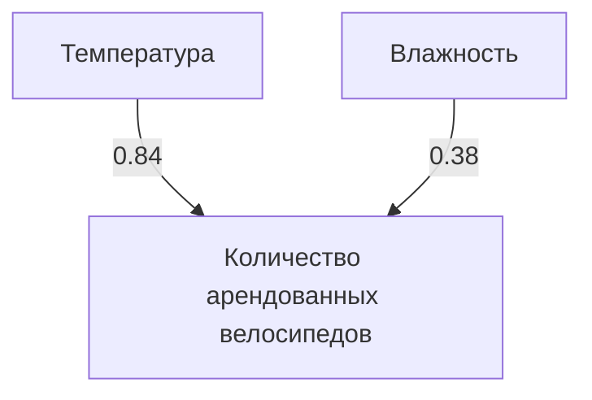

# Анализ корреляции в Pandas

## Методы поиска корреляции

В Pandas существуют различные методы для нахождения коэффициентов корреляции между переменными в датафрейме. Один из таких методов — `corr()`, который позволяет найти коэффициенты корреляции для всех количественных переменных датафрейма.

### Ограничения метода `corr()`

При использовании метода `corr()` необходимо учитывать, что он может включать в анализ переменные, которые не являются количественными, например, бинарные категориальные переменные. Это может привести к некорректным результатам. Поэтому важно отфильтровать ненужные переменные перед применением метода `corr()`.

## Добавление новых колонок в датафрейм

Для анализа корреляции можно добавить новые колонки в датафрейм. Например, можно добавить колонки с данными о влажности и скорости ветра, а затем найти среднее значение этих показателей за неделю.


> **Пояснение:** Процесс добавления новых колонок и их присоединение к исходному датафрейму.


После добавления новых колонок можно использовать метод `concat()` для присоединения их к исходному датафрейму.


## Анализ корреляции

После добавления новых колонок можно проанализировать корреляцию между всеми количественными переменными в датафрейме с помощью метода `corr()`.


### Интерпретация результатов

Результаты корреляции представлены в виде таблицы, где на диагонали находятся единицы, а остальные ячейки содержат коэффициенты корреляции между переменными. Коэффициенты корреляции могут быть положительными, отрицательными или нулевыми.

Например, корреляция между температурой и количеством арендованных велосипедов составляет 0,84, что указывает на сильную положительную связь. Корреляция между влажностью и количеством арендованных велосипедов составляет 0,38, что указывает на слабую положительную связь.



> **Пояснение:** Пример сильной и слабой положительной корреляции между переменными.


### Поиск самых высоких и самых низких корреляций

Для поиска самых высоких и самых низких корреляций можно использовать различные методы. Например, можно отсортировать значения корреляции по убыванию или возрастанию.

Также можно применить функцию `abs()`, чтобы избавиться от отрицательных значений, и затем отсортировать значения по модулю. Это позволит найти самые сильные и самые слабые корреляции независимо от их знака.

```mermaid
flowchart LR
    A[Сортировка корреляции] --> B[По убыванию]
    A --> C[По возрастанию]
    D[Применение abs()] --> E[Сортировка по модулю]
```

> **Пояснение:** Методы поиска самых высоких и самых низких корреляций.

