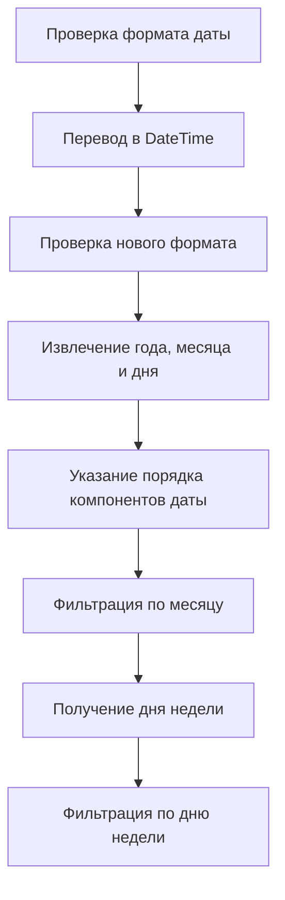

# Создание переменных в Pandas

## Создание агрегированных переменных

В этом разделе мы научимся создавать простые переменные, складывая значения из двух колонок и сохраняя результат в новой переменной.

### Пример создания агрегированной переменной

1. Импортируем библиотеки:
   ```python
   import pandas as pd
   ```

2. Открываем данные и выводим первые пять наблюдений:
   ```python
   df = pd.read_csv('data.csv')
   print(df.head())
   ```

3. Создаем новую переменную, складывая значения из двух колонок:
   ```python
   df['RentalCount'] = df['BikeSPartner1'] + df['BikeSPartner2']
   ```

4. Удаляем ненужные колонки:
   ```python
   del df['BikeSPartner1']
   del df['BikeSPartner2']
   ```

   *Примечание: для удаления колонок можно использовать метод `drop`:*
   ```python
   df = df.drop('BikeSPartner1', axis=1)
   df = df.drop('BikeSPartner2', axis=1)
   ```


*Диаграмма выше иллюстрирует последовательность шагов для создания агрегированной переменной и удаления ненужных колонок.*

## Работа с датами

В этом разделе мы научимся работать с датами, переводя их в формат `DateTime`.

### Перевод даты в формат `DateTime`

1. Проверяем текущий формат колонки с датой:
   ```python
   print(df.info())
   ```

2. Переводим дату в формат `DateTime`:
   ```python
   df['Date'] = pd.to_datetime(df['Date'])
   ```

3. Проверяем новый формат:
   ```python
   print(df['Date'].dtype)
   ```

4. Извлекаем год, месяц и день:
   ```python
   print(df['Date'].dt.year)
   print(df['Date'].dt.month)
   print(df['Date'].dt.day)
   ```

5. Указываем правильный порядок компонентов даты:
   ```python
   df['Date'] = pd.to_datetime(df['Date'], dayfirst=True)
   ```

6. Фильтруем данные по месяцу:
   ```python
   df_march = df[df['Date'].dt.month == 3]
   ```

7. Получаем название дня недели:
   ```python
   print(df['Date'].dt.day_name())
   ```

8. Фильтруем данные по дню недели:
   ```python
   df_sunday = df[df['Date'].dt.day_name() == 'Sunday']
   ```



*Диаграмма выше показывает последовательность шагов при работе с датами в формате `DateTime` и их фильтрации.*