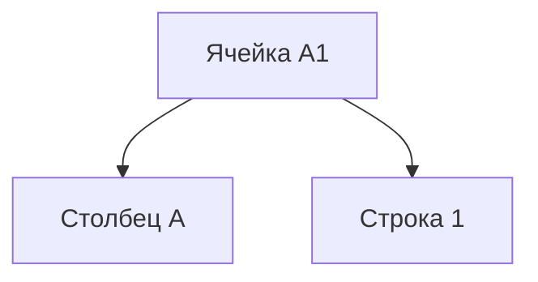

# Введение в Microsoft Excel

**Microsoft Excel** — это приложение Microsoft Office, предназначенное для работы с электронными таблицами. Оно позволяет хранить, организовывать и анализировать информацию.

---

## Интерфейс Excel

### Начальный экран

При первом открытии приложения вы видите начальный экран. Здесь вы можете:

- Создать новую рабочую книгу.
- Выбрать шаблон.
- Открыть одну из последних книг, с которыми вы работали.

### Лента

Лента является основным рабочим интерфейсом Microsoft Excel и содержит все команды, необходимые для выполнения наиболее распространённых задач. Лента состоит из вкладок:

Каждая вкладка содержит команды, сгруппированные по тематическим группам.

### Панель быстрого доступа

Панель быстрого доступа позволяет получить доступ к основным командам независимо от того, какая вкладка ленты на данный момент активна. По умолчанию она включает наиболее распространённые команды, такие как «сохранить», «отменить», «вернуть», «сортировка», «печать» и так далее. Вы всегда можете добавить любые команды, которые вам нужны.

---

## Работа с данными

### Ячейки и адресация

У каждого поля есть своё имя. Например, ячейка в левом верхнем углу обозначается именем A1. Сначала идёт буква, потом идёт число. Буква обозначает столбец, а число — строку. Таким образом, на каждую ячейку мы можем сослаться по адресу, который состоит из буквы, обозначающей столбец, и числа, обозначающего строку.

### Типы данных

Данные в Excel могут быть разных типов. Например, слово «привет» — это текстовые данные, но в Excel все данные оформляются под типом «общий». Этот тип позволяет работать как с текстом, так и с числами. Однако если нам принципиально нужно отметить, что это именно текст (для некоторых задач это важно), то мы можем выбрать нужный нам формат — «текстовый».

То же самое и с числами. Мы можем выбрать ячейку, в которой мы вписали число, и поменять для неё формат на «числовой». Для чисел больше вариантов, чем для текста. Например, если мы понимаем, что это число обозначает дату, или если мы понимаем, что это число обозначает некоторую сумму денежную, то мы можем выбрать денежный формат или формат даты.

---

## Рабочие книги и листы

Файлы Excel называются рабочими книгами. Каждая книга состоит из отдельных листов. Мы можем добавлять новые листы в ходе работы с Excel. Иногда Excel создаёт их автоматически, чтобы какие-то объёмные вычисления вытащить на отдельный лист и не загромождать основной.

---

## Настройка разделителя целой и дробной части числа

В Excel есть два варианта, как мы можем разделять целую и дробную часть числа. По умолчанию обычно в Excel это запятая. Однако в нашем курсе мы будем использовать точку, поэтому если у вас в настройках Excel стоит в качестве разделителя для целой и дробной части запятая, то вам нужно изменить эту настройку.

Для этого перейдите во вкладку **File**, выберите **Options**, затем **Advanced**. Найдите настройку, которая называется **Use system separators**, и уберите галочку. Напротив надписи **Decimal separator** введите точку. Таким образом, Excel будет понимать, что точку вы используете для разделения целой и дробной части.

---

## Заключение

Мы познакомились с интерфейсом приложения Microsoft Excel, посмотрели, что здесь есть различные вкладки с командами, узнали, как менять формат данных и настроили оформление числовых данных через точку. Теперь мы можем переходить к следующим видео, где будем выполнять различные вычисления и содержательные действия, которые помогут вам научиться проводить анализ данных.