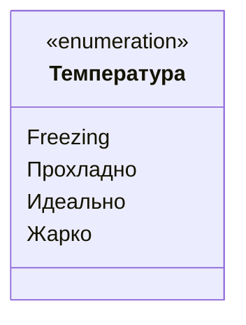
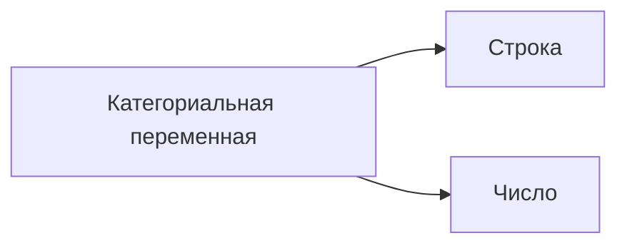

# Обработка данных: создание категориальных переменных и работа с форматами

## Создание категориальной переменной на основе количественной

Для преобразования количественной переменной (температура) в категориальную можно использовать следующую шкалу:

- **Freezing**: температура меньше 0 градусов.
- **Прохладно**: температура от 0 до 15 градусов.
- **Идеально**: температура от 15 до 26 градусов.
- **Жарко**: температура выше 26 градусов.



*Диаграмма выше показывает классификацию температурных категорий.*

Для реализации этого преобразования необходимо определить функцию, которая будет принимать температуру в качестве аргумента и возвращать соответствующую категорию. Пример такой функции:

```python
def categorize_temperature(temp):
    if temp < 0:
        return 'freezing'
    elif temp < 15:
        return 'прохладно'
    elif temp < 26:
        return 'идеально'
    else:
        return 'жарко'
```

Эта функция позволяет корректно обрабатывать пропущенные значения, сохраняя их в исходном виде.

## Применение функции к колонке данных

Для применения функции к колонке `temp` можно использовать метод `apply`:

```python
temp_cat = df['temp'].apply(categorize_temperature)
```

После применения функции можно сохранить результаты в новую переменную `temp_cat`.

## Изменение типа данных колонки

Для изменения типа данных колонки `date` на формат `datetime` можно использовать функцию `pd.to_datetime`:

```python
df['date'] = pd.to_datetime(df['date'])
```

## Перекодировка формата категориальной переменной

По умолчанию, категориальная переменная воспринимается как строковая. Для перекодировки формата можно использовать функцию `pd.Categorical`:

```python
df['temp_cat'] = pd.Categorical(df['temp_cat'])
```

После перекодировки колонка `temp_cat` будет иметь тип `category`, что позволит использовать дополнительные атрибуты.

### Преимущества типа `category`

Тип `category` позволяет одновременно хранить:

- Запись с строками в понятном для человека виде.
- Объект, в котором все категории закодированы числами.



*Диаграмма иллюстрирует двойное представление категориальной переменной.*

Это удобно для работы со статистическими моделями и визуализацией данных.

## Создание переменной на основе нескольких колонок

Для создания переменной `good_weather` на основе нескольких условий можно использовать функцию `numpy.where`:

```python
import numpy as np

good_weather = np.where(
    (df['temp_cat'] == 'идеально') &
    (df['norm_humidity'] == 1) &
    (df['wind_speed'] <= 4) &
    (df['rainfall'] == 0) &
    (df['snowfall'] == 0),
    1, 0
)
```

Эта функция позволяет создать массив данных, где 1 означает хорошую погоду, а 0 — плохую.


*Диаграмма показывает условия, необходимые для определения хорошей погоды.*

## Заключение

В ходе лекции были рассмотрены основные шаги по работе с данными:

- Создание бинарных переменных.
- Создание категориальных переменных.
- Перевод колонки в другой формат (категориальный или формат времени даты).

Эти навыки необходимы для начала работы с данными и их анализа.

