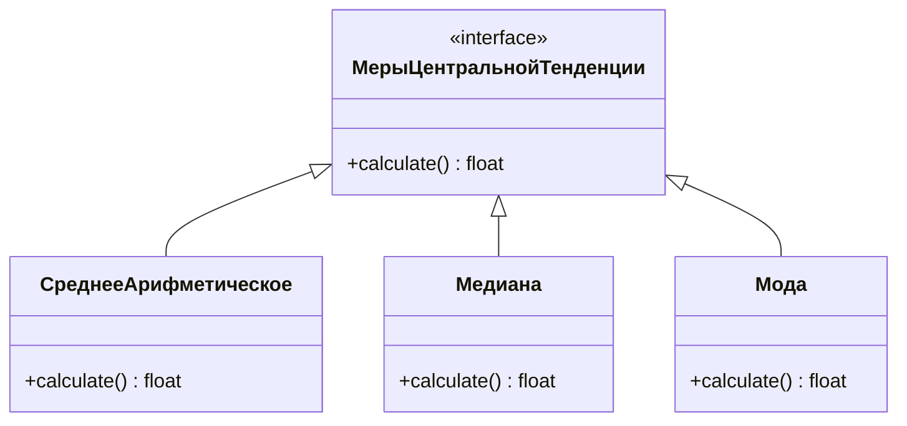
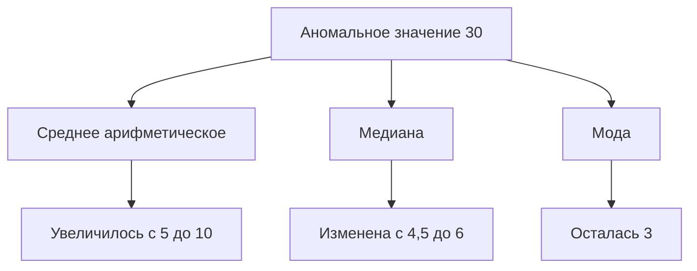

# Меры центральной тенденции

## Определение и виды мер центральной тенденции

Меры центральной тенденции используются для обобщения набора данных и определения центрального значения. Существуют три основные меры центральной тенденции:

**Пояснение**: На диаграмме представлены три основные меры центральной тенденции: среднее арифметическое, медиана и мода. Все они реализуют интерфейс для расчёта центрального значения.

1. **Среднее арифметическое** — сумма всех значений, делённая на их количество.
2. **Медиана** — значение, делящее упорядоченный набор данных пополам.
3. **Мода** — наиболее часто встречающееся значение в наборе данных.

## Расчёт мер центральной тенденции на примере

Рассмотрим пример расчёта мер центральной тенденции для набора данных: 3, 8, 6, 3.

### Среднее арифметическое

Для расчёта среднего арифметического необходимо сложить все значения и разделить на количество наблюдений:

$\text{Среднее} = \frac{3 + 8 + 6 + 3}{4} = 5$

### Медиана

Для расчёта медианы необходимо упорядочить данные и найти центральное значение:

Упорядоченный набор: 3, 3, 6, 8.

Медиана: $\frac{3 + 6}{2} = 4,5$

### Мода

Мода — это наиболее часто встречающееся значение. В данном случае мода равна 3.

## Влияние аномальных значений на меры центральной тенденции

Рассмотрим, как добавление аномального значения влияет на меры центральной тенденции. Добавим значение 30 к нашему набору данных:

Новый набор данных: 3, 8, 6, 3, 30.

### Среднее арифметическое

$\text{Новое среднее} = \frac{3 + 8 + 6 + 3 + 30}{5} = 10$

Видим, что среднее изменилось с 5 до 10.

### Медиана

Упорядоченный набор: 3, 3, 6, 8, 30.

Новая медиана: 6.

### Мода

Мода осталась неизменной и равна 3.

**Пояснение**: На диаграмме показано влияние аномального значения на каждую из мер центральной тенденции. Среднее арифметическое значительно увеличилось, медиана изменилась, а мода осталась прежней.

## Вывод

Аномальные значения могут сильно повлиять на среднее арифметическое, в то время как медиана и мода менее чувствительны к таким изменениям. Поэтому при анализе данных важно учитывать наличие аномальных значений и выбирать соответствующую меру центральной тенденции.