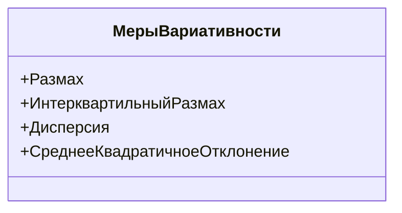
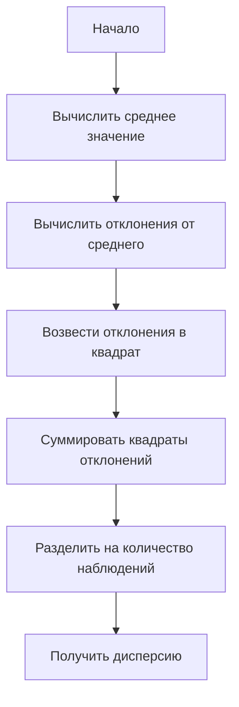

# Меры вариативности

## Определение и классификация мер вариативности

Меры вариативности используются для количественной оценки разброса данных в выборке или генеральной совокупности. Рассмотрим основные меры вариативности: размах, интерквартильный размах, дисперсию и среднее квадратичное отклонение.

_Диаграмма выше иллюстрирует основные меры вариативности, используемые для анализа разброса данных._

## Размах

Размах — это разница между максимальным и минимальным значениями в выборке.

Пример расчёта размаха:

- Дана выборка: $2, 10, 3, 6, 9$.
- Минимальное значение: $2$.
- Максимальное значение: $10$.
- Размах: $10 - 2 = 8$.

## Интерквартильный размах

Интерквартильный размах — это мера, которая показывает разброс между первой и третьей квартилями.

Пример расчёта интерквартильного размаха:

1. Упорядочить выборку: $2, 3, 6, 9, 10$.
2. Найти медиану (вторую квартиль): $6$.
3. Найти первую квартиль (середину левой части выборки): $(2 + 3) / 2 = 2,5$.
4. Найти третью квартиль (середину правой части выборки): $(9 + 10) / 2 = 9,5$.
5. Интерквартильный размах: $9,5 - 2,5 = 7$.

## Дисперсия и среднее квадратичное отклонение

### Дисперсия

Дисперсия — это мера разброса данных относительно среднего значения.

_Диаграмма выше показывает последовательность шагов для расчёта дисперсии._

#### Дисперсия генеральной совокупности

$\sigma^2 = \frac{\sum (x_i - \mu)^2}{N}$, где:
- $x_i$ — значение наблюдения;
- $\mu$ — среднее значение генеральной совокупности;
- $N$ — количество наблюдений в генеральной совокупности.

#### Дисперсия выборки

$s^2 = \frac{\sum (x_i - \bar{x})^2}{n - 1}$, где:
- $x_i$ — значение наблюдения;
- $\bar{x}$ — среднее значение выборки;
- $n$ — количество наблюдений в выборке.

Пример расчёта дисперсии:

- Дана выборка: $2, 10, 3, 6, 9$.
- Среднее значение: $(2 + 10 + 3 + 6 + 9) / 5 = 6$.
- Отклонения от среднего: $-4, 4, -3, 0, 3$.
- Квадраты отклонений: $16, 16, 9, 0, 9$.
- Сумма квадратов отклонений: $32 + 41 + 10 = 83$.
- Дисперсия генеральной совокупности: $83 / 5 = 16,6$.
- Дисперсия выборки: $83 / (5 - 1) = 20,75$.

### Среднее квадратичное отклонение

Среднее квадратичное отклонение — это квадратный корень из дисперсии.

- Среднее квадратичное отклонение генеральной совокупности: $\sigma = \sqrt{16,6} \approx 4,07$.
- Среднее квадратичное отклонение выборки: $s = \sqrt{20,75} \approx 4,56$.