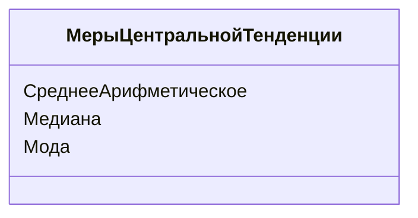

# Расчёт мер центральной тенденции в Pandas

## Определение мер центральной тенденции

Меры центральной тенденции позволяют определить «центральное» или «типичное» значение в наборе данных. К таким мерам относятся:

* **Среднее арифметическое** — сумма всех значений, делённая на их количество.
* **Медиана** — значение, разделяющее упорядоченный набор данных пополам.
* **Мода** — наиболее часто встречающееся значение в наборе данных.



*Диаграмма выше иллюстрирует основные меры центральной тенденции.*

## Расчёт мер центральной тенденции вручную

Для лучшего понимания процесса расчёта мер центральной тенденции рассмотрим пример с переменной *humidity* (влажность).

### Среднее арифметическое

Чтобы рассчитать среднее арифметическое, нужно сложить все значения переменной и разделить на их количество:

```python
sum(bike_share['humidity']) / len(bike_share['humidity'])
```

### Медиана

Для расчёта медианы нужно отсортировать значения переменной по возрастанию и найти серединное значение. Если количество наблюдений чётное, то медиана будет равна среднему арифметическому двух центральных значений.

```python
bike_share['humidity'].sort_values().reset_index(drop=True)
```

### Мода

Моду можно найти с помощью метода `value_counts()`. Этот метод возвращает таблицу с количеством повторений каждого значения.

```python
bike_share['humidity'].value_counts()
```

## Использование функций Pandas для расчёта мер центральной тенденции

В Pandas есть несколько функций для быстрого расчёта мер центральной тенденции:

* `mean()` — среднее арифметическое;
* `median()` — медиана;
* `mode()` — мода.

Например, чтобы рассчитать среднее арифметическое влажности, можно использовать следующую команду:

```python
bike_share['humidity'].mean()
```

## Метод `describe()`

Метод `describe()` возвращает сводную статистику для количественных переменных. Он предоставляет следующую информацию:

* количество значений;
* среднее арифметическое;
* стандартное отклонение;
* минимальное значение;
* максимальное значение;
* перцентили (25%, 50%, 75%).

```python
bike_share.describe()
```

Однако метод `describe()` не всегда учитывает все переменные, которые мы считаем количественными. Например, переменная `holiday` по факту является категориальной, но поскольку она закодирована числом, Pandas считает её количественной.

```mermaid
flowchart TD
    A[Метод describe()] --> B[Количество значений]
    A --> C[Среднее арифметическое]
    A --> D[Стандартное отклонение]
    A --> E[Минимальное значение]
    A --> F[Максимальное значение]
    A --> G[Перцентили (25%, 50%, 75%)]
```

*Диаграмма выше показывает структуру данных, возвращаемых методом `describe()`.*

## Ограничения метода `describe()`

Проблема с методом `describe()` заключается в том, что он возвращает сводную статистику для всех количественных переменных, которые Pandas считает таковыми. Не всегда наши мнения совпадают с тем, как Pandas классифицирует переменные.

## Заключение

Мы рассмотрели, как рассчитывать меры центральной тенденции вручную и с помощью функций Pandas. В следующем видео мы поговорим о том, как использовать эти меры в агрегирующих таблицах и отображать их на графике.