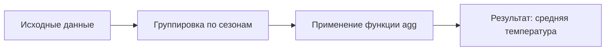
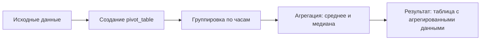

# Использование мер центральной тенденции в качестве агрегирующих статистик

## Группировка данных по часам

Для анализа данных можно использовать меры центральной тенденции. Например, можно сгруппировать данные по часам и найти среднее количество арендованных велосипедов в каждый час.

```python
groups = df.groupby('hour')
rental_count = groups['rental_count'].mean()
```


Можно визуализировать данные на графике, чтобы увидеть распределение количества арендованных велосипедов в зависимости от часа.

## Группировка данных по часам и погоде

Можно сделать более сложную группировку, сгруппировав данные по часам и погоде, и найти среднее количество аренды в хорошую погоду.

```python
groups = df.groupby(['hour', 'good_weather'])
rental_count = groups['rental_count'].mean()
```

## Нахождение моды для категориальной переменной

Для нахождения моды для категориальной переменной можно использовать функцию `value_counts()`. Например, можно найти модальную температуру в каждом сезоне.

```python
groups = df.groupby('season')
mode = groups['temperature_category'].apply(lambda x: x.value_counts().index[0])
```

Однако функция `mode` не работает так просто с объектом `groupby`. Поэтому можно использовать функцию `agg`, которая агрегирует данные.

```python
result = df.groupby('season').agg({'temperature': ['mean', 'median', lambda x: x.value_counts().index[0]]})
```

## Агрегирование данных с помощью функции `agg`

Функция `agg` позволяет агрегировать данные с помощью различных функций. Например, можно найти среднюю температуру для каждого сезона.

```python
result = df.groupby('season').agg({'temperature': 'mean'})
```

Преимущество функции `agg` в том, что она может взять любую функцию в качестве аргумента. Это позволяет агрегировать данные различными способами.

### Процесс агрегирования данных с помощью `agg`



На диаграмме показан процесс агрегирования данных с помощью функции `agg`. Сначала данные группируются по сезонам, затем применяется функция `agg`, и в результате получается средняя температура для каждого сезона.

## Создание таблиц с агрегированными данными с помощью `pivot_table`

Ещё один метод создания таблиц с агрегированными данными — это `pivot_table`. Этот метод позволяет создавать более сложные таблицы с агрегированными данными.

```python
pivot_table = df.pivot_table(index='hour', values=['temperature', 'rental_count'], aggfunc=['mean', 'median'])
```

### Пример использования `pivot_table`



На диаграмме показан процесс создания таблицы с агрегированными данными с помощью `pivot_table`. Данные группируются по часам, затем агрегируются с использованием среднего и медианы, и в результате получается таблица с агрегированными данными.