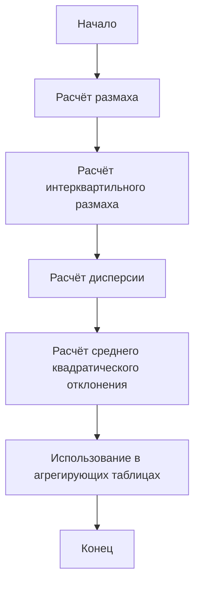
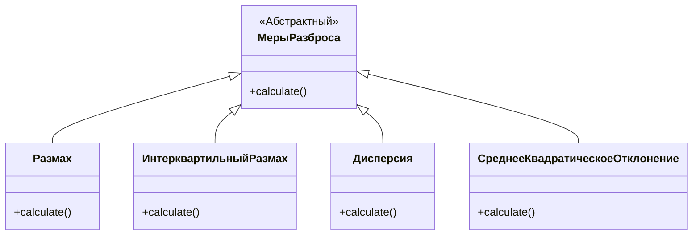
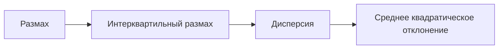
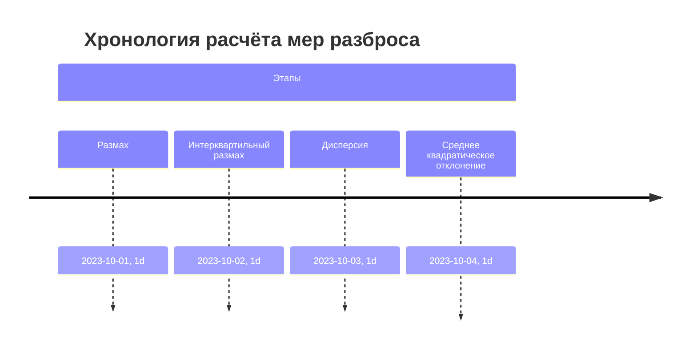

# Расчёт мер разброса в Python с использованием библиотеки Pandas

## Введение

В данном конспекте рассматривается процесс расчёта различных мер разброса для анализа данных с использованием библиотеки Pandas в Python. Описываются методы расчёта размаха, интерквартильного размаха, дисперсии и среднего квадратического отклонения.

## Меры разброса

### Размах

Размах рассчитывается по формуле:

$$
\text{Размах} = \text{max} - \text{min}
$$

где $\text{max}$ — максимальное значение, а $\text{min}$ — минимальное значение в наборе данных.

Пример расчёта размаха:

```python
ByXour.RentalCount.max() - ByXour.RentalCount.min()
```

### Интерквартильный размах

Интерквартильный размах рассчитывается как разность между 75-м и 25-м процентилями:

$$
\text{IQR} = Q_{75} - Q_{25}
$$

где $Q_{75}$ — 75-й процентиль, а $Q_{25}$ — 25-й процентиль.

Пример расчёта интерквартильного размаха:

```python
Q75 = bikes_hour.RentalCount.quantile(0.75)
Q25 = bikes_hour.RentalCount.quantile(0.25)
IQR = Q75 - Q25
```

### Дисперсия и среднее квадратическое отклонение

Дисперсия и среднее квадратическое отклонение могут быть рассчитаны для выборки или генеральной совокупности. Для выборки дисперсия рассчитывается как сумма квадратов отклонений от среднего, делённая на количество наблюдений минус 1:

$$
\sigma^2 = \frac{\sum_{i=1}^{n} (x_i - \bar{x})^2}{n - 1}
$$

где $\sigma^2$ — дисперсия, $x_i$ — значение в выборке, $\bar{x}$ — среднее значение, $n$ — количество наблюдений.

Среднее квадратическое отклонение — это квадратный корень из дисперсии:

$$
\sigma = \sqrt{\sigma^2}
$$

Пример расчёта дисперсии и среднего квадратического отклонения для выборки:

```python
mean = ByXower.RentalCount.mean()
deviations = ByXower.RentalCount - mean
squared_deviations = deviations**2
variance = squared_deviations.sum() / (len(ByXower) - 1)
std_dev = variance**0.5
```

Для генеральной совокупности дисперсия рассчитывается аналогично, но без вычитания 1 из количества наблюдений:

$$
\sigma^2 = \frac{\sum_{i=1}^{n} (x_i - \bar{x})^2}{n}
$$

Пример расчёта дисперсии и среднего квадратического отклонения для генеральной совокупности:

```python
variance_population = squared_deviations.sum() / len(ByXower)
std_dev_population = variance_population**0.5
```

## Использование мер разброса в агрегирующих таблицах

Меры разброса могут быть использованы в агрегирующих таблицах для анализа данных. Например, можно рассчитать среднее квадратическое отклонение для каждого часа:

```python
grouped = bikes.groupby('Hour')
grouped.RentalCount.std()
```

Также можно использовать меры разброса в пивотальных таблицах:

```python
pivot_table = pd.pivot_table(bikes, index='Hour', values='RentalCount', aggfunc=[np.mean, np.std, my_range])
```

где `my_range` — пользовательская функция для расчёта размаха.

## Заключение

В данном конспекте были рассмотрены методы расчёта различных мер разброса с использованием библиотеки Pandas в Python. Были описаны методы расчёта размаха, интерквартильного размаха, дисперсии и среднего квадратического отклонения. Также было показано, как использовать меры разброса в агрегирующих и пивотальных таблицах.

## Диаграммы

### Процесс расчёта мер разброса



### Сравнение мер разброса



### Взаимосвязь мер разброса



### Хронология расчёта мер разброса



## Специальные метки


