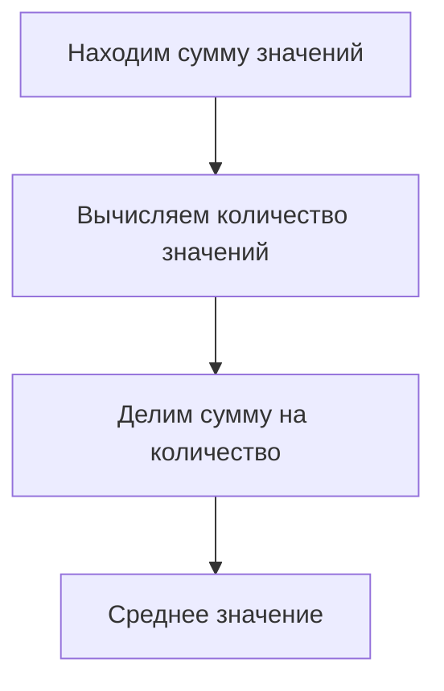
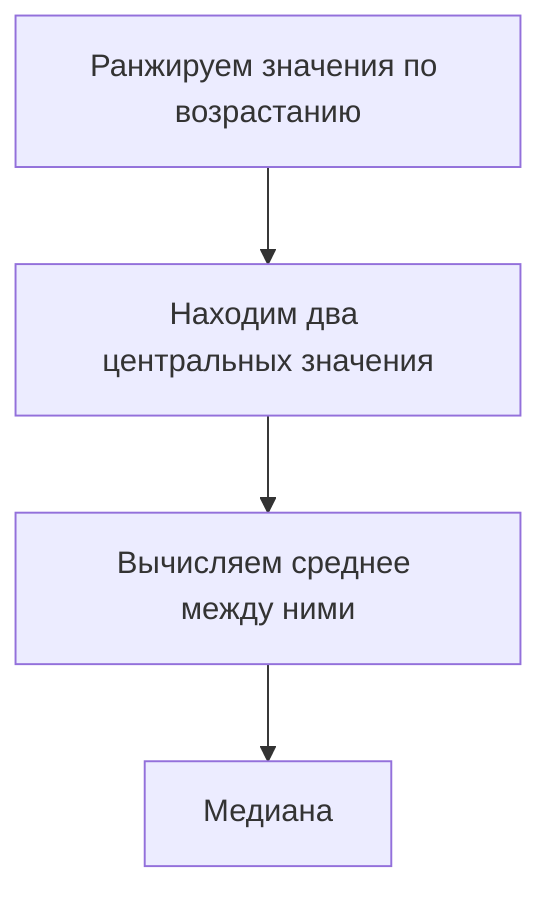
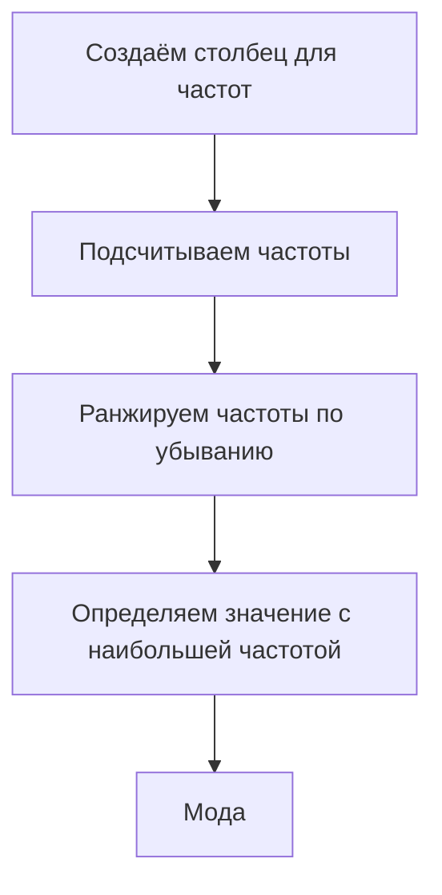
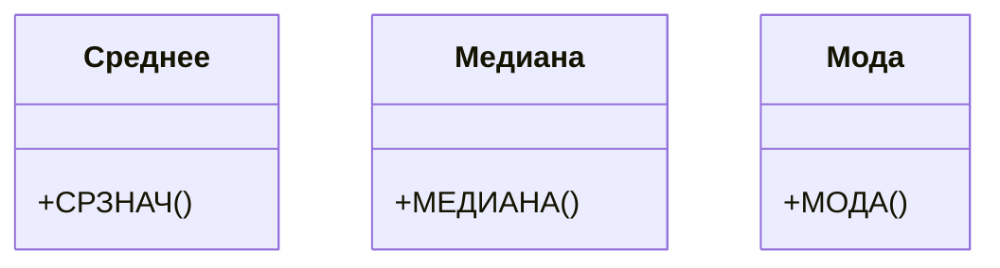

# Вычисление мер центральной тенденции для данных

## Вычисление среднего значения

Для вычисления среднего значения по определению необходимо сумму всех значений разделить на их количество.

1. Находим сумму значений:
   - Используем функцию `СУММ`.
   - Выделяем столбец с данными о влажности.

2. Вычисляем количество значений:
   - Используем функцию `СЧЁТ`.
   - Выделяем столбец с данными о влажности.

3. Вычисляем среднее значение:
   - Делим сумму значений на их количество.

Пример: для 8760 наблюдений среднее значение влажности составило 58,2.

## Вычисление медианы

Для вычисления медианы необходимо отсортировать все значения по возрастанию и найти среднее значение между двумя центральными значениями.

1. Ранжируем значения влажности по возрастанию.
2. Находим два центральных значения.
3. Вычисляем среднее значение между ними.

Пример: медиана влажности для 8760 наблюдений составила 57.

## Вычисление моды

Для вычисления моды необходимо найти частоты для всех значения и определить значение с наибольшей частотой.

1. Создаём вспомогательный столбец для подсчёта частоты каждого значения.
2. Используем функцию `СЧЁТЕСЛИ` для подсчёта частоты каждого значения.
3. Ранжируем столбец с частотами по убыванию.
4. Определяем значение с наибольшей частотой.

Пример: для влажности равные 53 и 97 имеют наибольшую частоту 173, следовательно, у нас две моды: 53 и 97.

## Использование стандартных функций для вычисления мер центральной тенденции

### Среднее значение

Используем функцию `СРЗНАЧ`:
- Выделяем столбец с данными о влажности.
- Получаем среднее значение, равное вычисленному по определению.

### Медиана

Используем функцию `МЕДИАНА`:
- Выделяем столбец с данными о влажности.
- Получаем медиану, равную вычисленной вручную.

### Мода

Используем функцию `МОДА`:
- Выделяем столбец с данными о влажности.
- Получаем моду, равную вычисленной вручную.

## Вычисление мер центральной тенденции с учётом условий

### Среднее значение с условием

Используем функцию `СРЗНАЧЕСЛИ`:
- Выделяем диапазон с условиями (например, сезоны).
- Прописываем условие (например, «Зима»).
- Выбираем диапазон для вычисления среднего значения.

Пример: средняя влажность для зимы составила 49,744.

### Медиана с условием

Для вычисления медианы с условием используем вложенную функцию `ЕСЛИ`:
- Проверяем условие в столбце с сезонами.
- Используем функцию для массива, чтобы закрепить массив ячеек.
- Нажимаем `Ctrl + Shift + Enter` для запуска функции.

Пример: медианное значение влажности для зимы составило 47.

## Диаграммы и схемы

### Процесс вычисления среднего значения

*Диаграмма иллюстрирует последовательность шагов для вычисления среднего значения.*

### Процесс вычисления медианы

*Диаграмма показывает алгоритм вычисления медианы.*

### Процесс вычисления моды

*Диаграмма демонстрирует шаги для нахождения моды.*

### Сравнение стандартных функций

*Диаграмма классифицирует стандартные функции для вычисления мер центральной тенденции.*

## Вставка изображений

