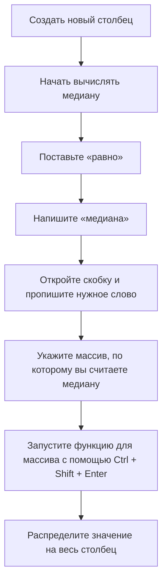

# Поиск мер центральной тенденции с дополнительными условиями с помощью сводных таблиц

## Создание сводной таблицы

1. Выделите все столбцы.
2. Перейдите в меню «Вставка» и добавьте сводную таблицу. Появится новый лист для создания сводной таблицы.

### Пример: поиск средней температуры для каждого сезона

1. Переместите переменную «сезоны» в строки.
2. Переместите переменную «температура» в поле значений.
3. Измените параметр по умолчанию значений на «среднее».

Теперь можно видеть, что у нас посчитали средние значения для температуры для каждого из сезонов.

### Пример: подсчёт суммарного количества аренд для каждого часа

1. Уберите переменные, которые вы перетаскивали в поля.
2. Добавьте в строки переменную с часом.
3. В значение добавьте переменную с общим количеством аренд.
4. Измените параметр по умолчанию значений с «количество» на «сумма».

Чтобы найти среднее значение, измените «сумму» на «среднее».

## Добавление медианы

К сожалению, добавить медиану так же просто, как среднее, не получится. Придётся использовать функцию «медиана» с добавлением внутренней функции «если».

Теперь можно создать сводную таблицу с этим значением.

## Подсчёт моды с помощью подсчёта частот

С помощью подсчёта частот можно найти моды с помощью сводных таблиц по каким-то условиям.

1. Уберите все переменные из сводной таблицы.
2. Переместите переменную с сезоном в строки, а переменную с типом температуры в столбец.
3. Уберите пустые значения и нулевые.

Таким образом, с помощью подсчёта частот можно найти моды для разных сезонов.

## Заключение

В этом видео мы посмотрели, как с помощью сводных таблиц находить меры центральной тенденции с добавлением условий, рассчитывать среднее значение, медиану и моду, если мы хотим рассчитать их для определённых категорий, а не просто для всех наблюдений, которые у нас есть.