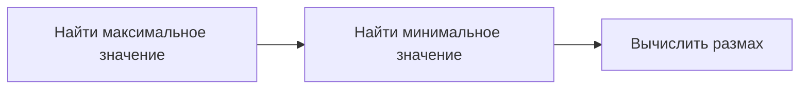
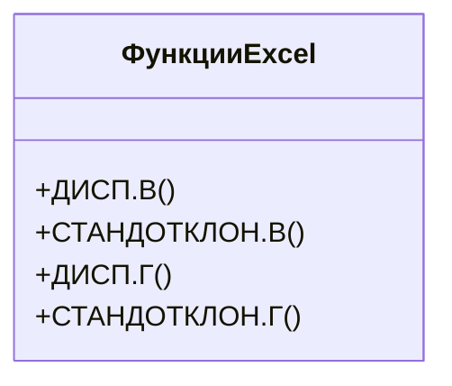

# Вычисление мер разброса в Excel

## Определение мер разброса

Меры разброса используются для анализа распределения данных. В данном случае мы будем вычислять меры разброса для общего количества аренд для каждого часа.

### Шаг 1: Подсчёт общего количества аренд для каждого часа

1. Создаём таблицу с количеством аренд для каждого часа с 0 до 23.
2. Используем функцию `СУММЕСЛИ` для подсчёта общего количества аренд для каждого часа:
   - Диапазон с часами: `столбец B`.
   - Диапазон с количеством аренд: `столбец M`.

### Шаг 2: Вычисление размаха

Размах — это разница между максимальным и минимальным значениями.

1. Находим максимальное значение с помощью функции `MAX`.
2. Находим минимальное значение с помощью функции `MIN`.
3. Вычисляем размах: `размах = максимальное значение - минимальное значение`.

### Шаг 3: Вычисление межквартильного размаха

Межквартильный размах — это разница между верхним и нижним квартилями.

1. Находим верхний квартиль (третий квартиль) с помощью функции `КВАРТИЛЬ`.
2. Находим нижний квартиль (первый квартиль) с помощью функции `КВАРТИЛЬ`.
3. Вычисляем межквартильный размах: `межквартильный размах = верхний квартиль - нижний квартиль`.

## Вычисление дисперсии и стандартного отклонения

### Шаг 1: Вычисление дисперсии по определению

1. Находим среднее значение по количеству аренд с помощью функции `СРЗНАЧ`.
2. Вычисляем отклонение каждого наблюдения от среднего.
3. Возводим отклонения в квадрат.
4. Суммируем квадраты отклонений.
5. Делим сумму на количество наблюдений минус 1 (для выборки) или на количество наблюдений (для генеральной совокупности).

### Шаг 2: Вычисление стандартного отклонения

Стандартное отклонение — это квадратный корень из дисперсии.

Используем функцию `КОРЕНЬ` для вычисления стандартного отклонения.

### Шаг 3: Использование специальных функций в Excel

В Excel есть специальные функции для вычисления дисперсии и стандартного отклонения:

- Для выборки: `ДИСП.В` и `СТАНДОТКЛОН.В`.
- Для генеральной совокупности: `ДИСП.Г` и `СТАНДОТКЛОН.Г`.