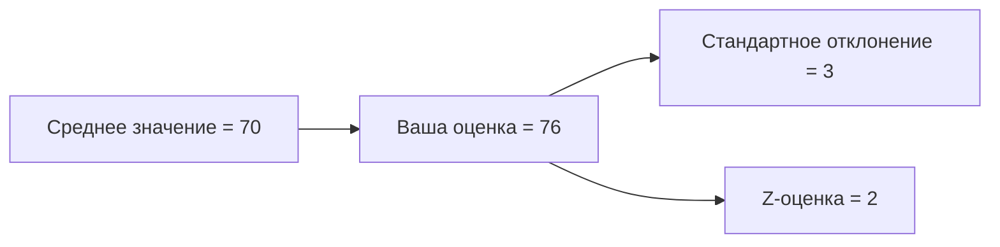
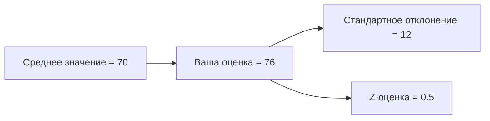
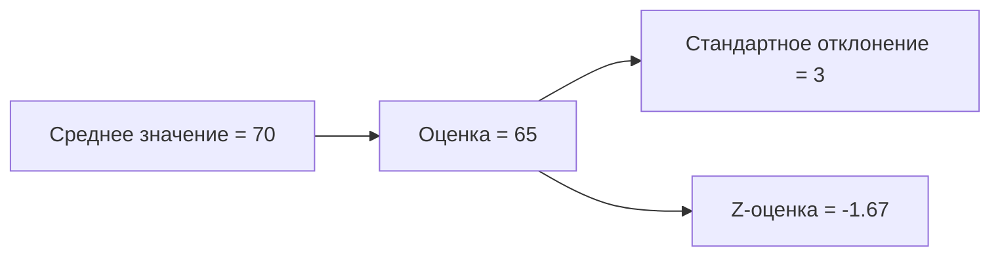
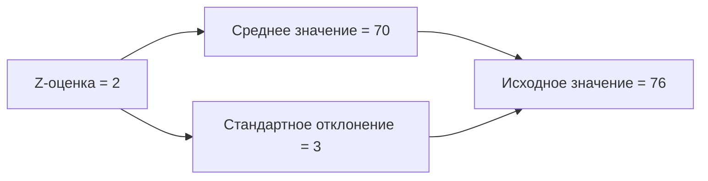

# Расчёт Z-оценки и стандартизированное распределение

## Понятие Z-оценки

**Z-оценка** позволяет определить, насколько оценка или значение наблюдения отличается от среднего значения в терминах стандартного отклонения. Это даёт возможность сравнивать различные оценки и стандартизировать разные распределения.

### Формула расчёта Z-оценки

Для расчёта Z-оценки используется следующая формула:

$Z = \frac{X - \mu}{\sigma}$

где:
- $X$ — значение наблюдения,
- $\mu$ — среднее значение,
- $\sigma$ — стандартное отклонение.

Для выборки формула выглядит так:

$Z = \frac{X - M}{S}$

где:
- $M$ — среднее значение выборки,
- $S$ — стандартное отклонение выборки.

## Примеры расчёта Z-оценки

Рассмотрим несколько примеров расчёта Z-оценки для разных ситуаций.

### Пример 1

Предположим, что вы набрали 76 баллов на экзамене EG. Среднее значение в этом случае равно 70, а стандартное отклонение — 3.

Расчёт Z-оценки:

$Z = \frac{76 - 70}{3} = 2$

Таким образом, Z-оценка равна 2, что означает, что ваша оценка находится на расстоянии двух стандартных отклонений от среднего.

### Пример 2

Теперь предположим, что стандартное отклонение в другом распределении равно 12.

Расчёт Z-оценки:

$Z = \frac{76 - 70}{12} = 0,5$

В этом случае Z-оценка равна 0,5, что означает, что ваша оценка находится на расстоянии половины стандартного отклонения от среднего.

### Пример 3

Предположим, что в первом распределении кто-то получил оценку 65.

Расчёт Z-оценки:

$Z = \frac{65 - 70}{3} \approx -1,67$

Отрицательная Z-оценка указывает на то, что наблюдение располагается слева от среднего.

## Обратная задача: расчёт исходного значения по Z-оценке

Зная Z-оценку, среднее значение и стандартное отклонение, можно рассчитать исходное значение наблюдения:

$X = \mu + Z \cdot \sigma$

Например, для первого примера:

$X = 70 + 2 \cdot 3 = 76$

Таким образом, мы получили исходное значение оценки.

Диаграммы выше иллюстрируют процесс расчёта Z-оценки и обратной задачи, помогая визуализировать взаимосвязь между средним значением, стандартным отклонением и Z-оценкой.