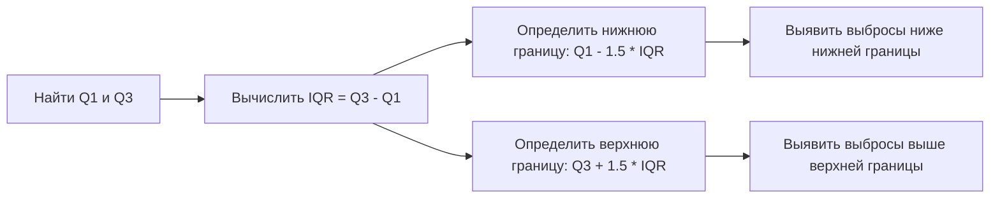
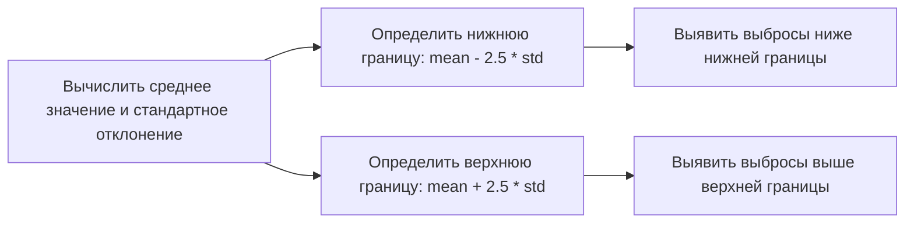
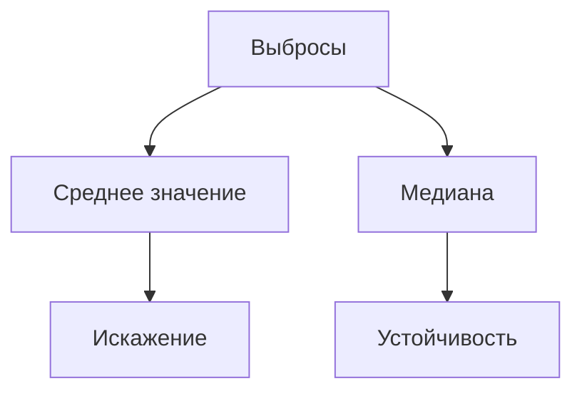
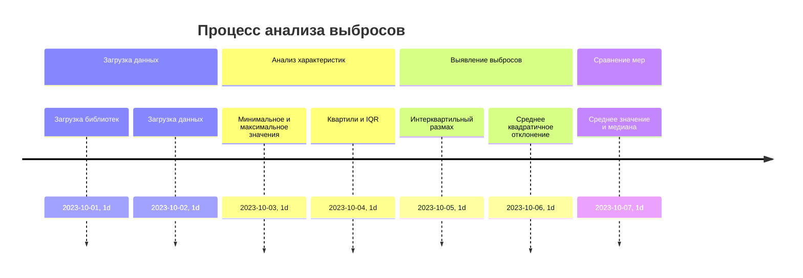

# Выбросы в данных: определение и методы выявления

## Определение выбросов

**Выбросы** — это аномальные значения в наборе данных, которые могут существенно влиять на статистические характеристики и анализ данных. В данном конспекте рассматриваются два метода определения выбросов: через *интерквартильный размах* и через *среднее квадратичное отклонение*.

## Методы определения выбросов

### Интерквартильный размах

1. **Определение интерквартильного размаха (IQR):**
   - Найти первый квартиль (Q1) и третий квартиль (Q3).
   - IQR = Q3 - Q1.

2. **Определение границ выбросов:**
   - Нижняя граница: Q1 - 1,5 * IQR.
   - Верхняя граница: Q3 + 1,5 * IQR.

3. **Выявление выбросов:**
   - Все значения ниже нижней границы и выше верхней границы считаются выбросами.

*Диаграмма выше иллюстрирует процесс выявления выбросов через интерквартильный размах.*

### Среднее квадратичное отклонение

1. **Определение среднего значения и стандартного отклонения:**
   - Среднее значение (mean).
   - Стандартное отклонение (std).

2. **Определение границ выбросов:**
   - Нижняя граница: mean - 2,5 * std.
   - Верхняя граница: mean + 2,5 * std.

3. **Выявление выбросов:**
   - Все значения ниже нижней границы и выше верхней границы считаются выбросами.

*Диаграмма выше показывает процесс выявления выбросов через среднее квадратичное отклонение.*

## Влияние выбросов на меры центральной тенденции

Выбросы могут существенно влиять на среднее значение и медиану. В частности, они могут искажать среднее значение, делая его менее репрезентативным для данных. Медиана, как правило, более устойчива к выбросам.

*Диаграмма выше показывает влияние выбросов на меры центральной тенденции.*

## Пример анализа выбросов

Рассмотрим пример анализа выбросов в данных о прокате велосипедов:

1. **Загрузка данных и библиотек:**
   - Библиотека Pandas.
   - Библиотека NumPy.
   - Данные о прокате велосипедов.

2. **Анализ основных статистических характеристик:**
   - Минимальное и максимальное значения.
   - Первый и третий квартили.
   - Интерквартильный размах.

3. **Определение выбросов через интерквартильный размах:**
   - Вычисление границ выбросов.
   - Фильтрация данных для выявления выбросов.

4. **Определение выбросов через среднее квадратичное отклонение:**
   - Вычисление среднего значения и стандартного отклонения.
   - Определение границ выбросов.
   - Фильтрация данных для выявления выбросов.

5. **Сравнение мер центральной тенденции:**
   - Среднее значение и медиана для исходных данных.
   - Среднее значение и медиана для данных без выбросов.

*Диаграмма выше иллюстрирует этапы анализа выбросов в данных о прокате велосипедов.*