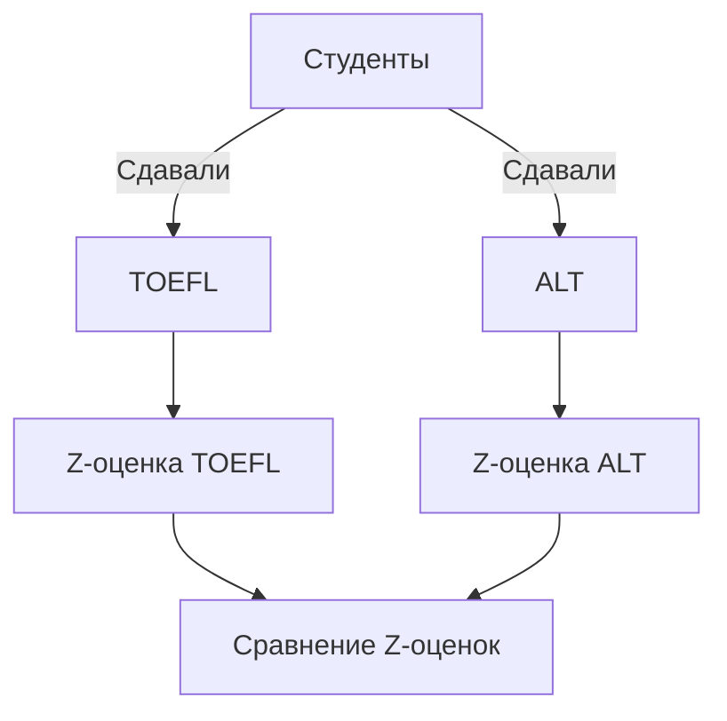

# Z-оценка и Z-стандартизация

## Введение

Z-оценка (Z-стандартизация) используется для сравнения результатов экзаменов, которые оцениваются по разным шкалам. Это позволяет определить, насколько результат отдельного студента выше или ниже среднего по группе.

## Подготовка данных

Для работы с данными необходимо импортировать библиотеки **Pandas** и **SciPy**.

```python
import pandas as pd
from scipy import stats
```

Далее необходимо загрузить данные и проверить их корректность. В данном случае данные содержат информацию о студентах, типе экзамена (TOEFL или ALT), их оценке и факте прохождения углублённого курса по изучению языка.


## Анализ данных

### Распределение переменной «скор»

Распределение переменной «скор» показывает, что студенты сдавали два разных экзамена: TOEFL (оценивается от 0 до 120) и ALT (оценивается по 9-балльной шкале).

Для анализа данных необходимо отфильтровать студентов, сдававших TOEFL, и студентов, сдававших ALT.

```python
toefl_students = df[df['exam'] == 'TOEFL']
ils_students = df[df['exam'] == 'ILS']
```

### Стандартизация данных

Чтобы найти Z-оценку, необходимо вычесть среднее значение из оценки студента и разделить результат на среднеквадратичное отклонение.

Для расчёта Z-оценки для TOEFL:

```python
x = toefl_students['score'].iloc[0]  # Оценка первого студента
mean = toefl_students['score'].mean()  # Среднее значение оценок TOEFL
std = toefl_students['score'].std(ddof=0)  # Среднеквадратичное отклонение

z_score = (x - mean) / std
```

Для расчёта Z-оценки для ALT:

```python
x = ils_students['score'].iloc[0]  # Оценка первого студента
mean = ils_students['score'].mean()  # Среднее значение оценок ALT
std = ils_students['score'].std(ddof=0)  # Среднеквадратичное отклонение

z_score = (x - mean) / std
```

### Использование функции zscore

Для автоматического расчёта Z-оценок можно использовать функцию `zscore` из библиотеки `SciPy`.

```python
from scipy.stats import zscore

toefl_students['z_score'] = zscore(toefl_students['score'])
ils_students['z_score'] = zscore(ils_students['score'])
```

## Сравнение результатов

После расчёта Z-оценок можно сравнить результаты студентов, сдавших разные экзамены.

```python
combined_df = pd.concat([toefl_students, ils_students])
```

Теперь можно увидеть распределение Z-оценок для всех студентов.



**Пояснение:** На диаграмме показан процесс стандартизации и сравнения Z-оценок для студентов, сдавших разные экзамены.

## Выводы

Z-оценка позволяет сравнивать результаты экзаменов, которые оцениваются по разным шкалам. Это полезно для анализа успеваемости студентов и определения их относительного положения в группе.