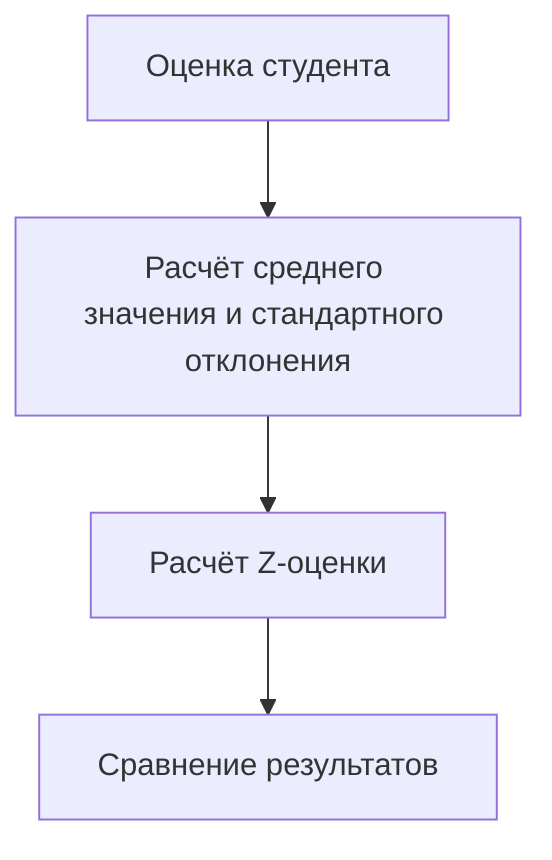
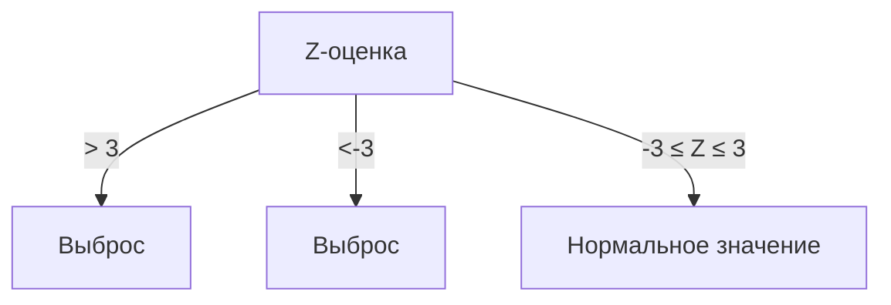
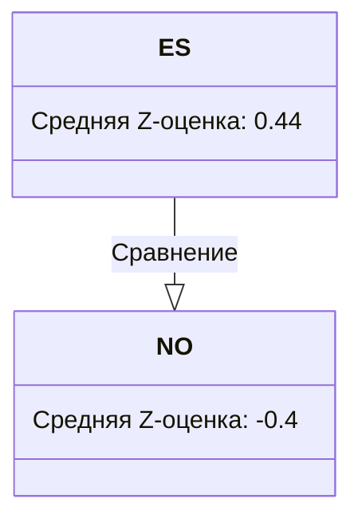

# Стандартизация данных и сравнение результатов экзаменов с разными шкалами

## Введение

В данном материале рассматривается метод стандартизации данных для сравнения результатов экзаменов с различными шкалами оценок, таких как TOEFL и IELTS.

## Шаги стандартизации данных

1. **Расчёт среднего значения и стандартного отклонения для каждого экзамена:**
   - Для TOEFL среднее значение составляет 93,776, а стандартное отклонение — 17,8.
   - Для IELTS среднее значение составляет 6,43, а стандартное отклонение — 1,57.

2. **Перевод оценок в Z-оценки:**
   - Z-оценка рассчитывается по формуле: \( Z = \frac{X - \mu}{\sigma} \), где \( X \) — оценка студента, \( \mu \) — среднее значение, \( \sigma \) — стандартное отклонение.
   - Пример расчёта Z-оценки для TOEFL: если оценка студента равна 100, то Z-оценка будет равна \( \frac{100 - 93,776}{17,8} \approx 0,35 \).

*Диаграмма иллюстрирует процесс стандартизации данных от исходной оценки студента до сравнения результатов.*

## Выявление выбросов

- Выбросы определяются как значения Z-оценок, превышающие 3 или меньшие -3.
- Пример: после применения фильтра выявлено два студента с низкими значениями, которые являются выбросами.

*Диаграмма показывает, как Z-оценки классифицируются на выбросы и нормальные значения.*

## Сравнение результатов студентов, занимавшихся и не занимавшихся дополнительно

- Рассчитана средняя Z-оценка для студентов, занимавшихся английским языком дополнительно (ES), и для тех, кто не занимался (NO).
- Средняя Z-оценка для ES составляет 0,44, а для NO — -0,39 (округлено до -0,4).

*Диаграмма сравнивает средние Z-оценки студентов, занимавшихся и не занимавшихся дополнительно.*

## Заключение

В результате стандартизации данных и расчёта Z-оценок стало возможным сравнить результаты студентов, сдававших экзамены TOEFL и IELTS, и выявить влияние дополнительных занятий по английскому языку на результаты тестов.

