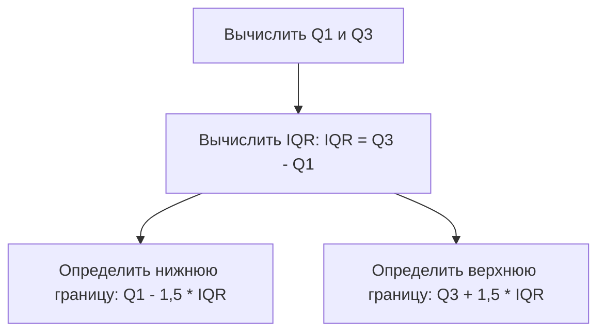
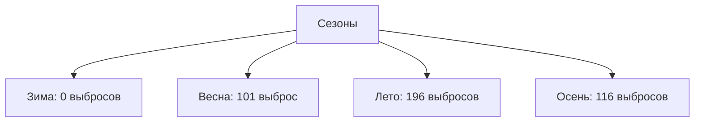

# Определение выбросов в данных

## Вычисление границ выбросов

Для определения выбросов необходимо вычислить границы, за пределами которых значения считаются выбросами. Это делается с помощью **межквартильного размаха (IQR)**.

1. Вычисляем **верхний квартиль (Q3)** и **нижний квартиль (Q1)** для анализируемого столбца данных.
   - Для вычисления верхнего квартиля используем функцию `квартиль` и указываем третий квартиль.
   - Для вычисления нижнего квартиля используем ту же функцию и указываем первый квартиль.

   

   Пример:
   - Верхний квартиль (Q3) = 109
   - Нижний квартиль (Q1) = 157

2. Вычисляем межквартильный размах (IQR):
   - IQR = Q3 - Q1 = 852

3. Определяем границы выбросов:
   - Нижняя граница = Q1 - 1,5 * IQR = -1021
   - Верхняя граница = Q3 + 1,5 * IQR = 2287

## Фильтрация выбросов

После определения границ выбросов можно фильтровать данные, чтобы найти значения, превышающие верхнюю границу.

- Применяем фильтр к столбцу с общим количеством аренд и выбираем значения больше 2287.

  

  Пример:
  - После фильтрации осталось 413 записей, что означает наличие 413 выбросов.

## Подсчёт выбросов по категориям

Для подсчёта выбросов по категориям (например, по часам или сезонам) можно использовать логическую функцию `счётеслиМН`.

### Подсчёт выбросов по часам

1. Создаём таблицу с часами от 0 до 23.
2. Используем функцию `счётеслиМН` для подсчёта количества выбросов для каждого часа.

   Пример:
   - Для 8 часов: 38 выбросов
   - Для 18 часов: 95 выбросов

### Подсчёт выбросов по сезонам

1. Создаём таблицу с сезонами (зима, весна, лето, осень).
2. Используем функцию `счётеслиМН` для подсчёта количества выбросов для каждого сезона.

   Пример:
   - Зима: 0 выбросов
   - Весна: 101 выброс
   - Лето: 196 выбросов
   - Осень: 116 выбросов

Диаграмма выше иллюстрирует распределение выбросов по сезонам.