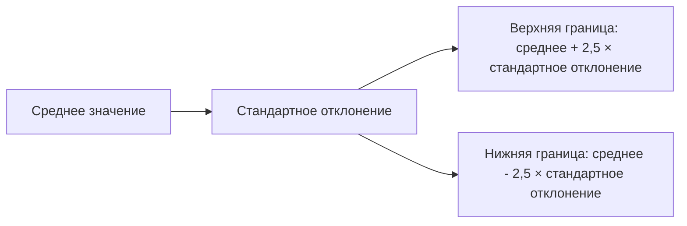

# Выявление выбросов с помощью стандартного отклонения

## Методы определения выбросов

Ранее мы уже находили границы для выбросов, используя межквартильный размах. Однако это можно делать также с помощью среднего и стандартного отклонения. Будем считать, что все значения, которые не являются выбросами, находятся в пределах **среднее ± 2,5 стандартных отклонений**.

## Расчёт границ для выбросов

Для начала необходимо рассчитать среднее значение. Это можно сделать с помощью функции **СРЗНАЧ**.


Затем следует рассчитать стандартное отклонение по выборке с помощью функции **СТАНДОТКЛОН.В**.

После этого можно найти верхнюю и нижнюю границы, за которыми могут находиться выбросы:

- Верхняя граница: среднее + 2,5 × стандартное отклонение.
- Нижняя граница: среднее − 2,5 × стандартное отклонение.

### Пример расчёта

1. Рассчитаем среднее значение: 696 и 5821.
2. Рассчитаем стандартное отклонение: примерно 750.
3. Найдём верхнюю границу: 2571 и 114 000.
4. Найдём нижнюю границу: −1777 и 95 сотых.

Так как количество аренд — это положительное число, можно сделать вывод, что выбросов со стороны нижней границы нет. Однако могут быть выбросы, которые больше верхней границы.



*Диаграмма иллюстрирует процесс расчёта границ для выбросов на основе среднего значения и стандартного отклонения.*

## Влияние выбросов на меры центральной тенденции

Рассмотрим, как выбросы влияют на среднее и медиану.

1. Уберём фильтры и посчитаем среднее и медиану для всех наблюдений.
2. Посчитаем эти значения, если бы мы убрали все выбросы.

Для среднего используем функцию **СРЗНАЧЕСЛИ**, а для медианы — функцию **МЕДИАНА** с условием.

### Результаты расчёта

- Среднее значение для всех наблюдений: примерно 697.
- Среднее значение для наблюдений без выбросов: 613.
- Медиана для всех значений: 425,5.
- Медиана для значений без выбросов: 402.

```mermaid
bar
    title Влияние выбросов на среднее и медиану
    x-axis Среднее значение, Медиана
    y-axis Значение
    series "Все наблюдения" [697, 425.5]
    series "Без выбросов" [613, 402]
```

*Диаграмма показывает, как выбросы влияют на среднее значение и медиану. Среднее значение значительно изменяется, в то время как медиана остаётся более стабильной.*

Таким образом, выбросы сильно влияют на среднее значение, но слабо — на медиану. Среднее значение намного более чувствительно к выбросам, чем медиана.