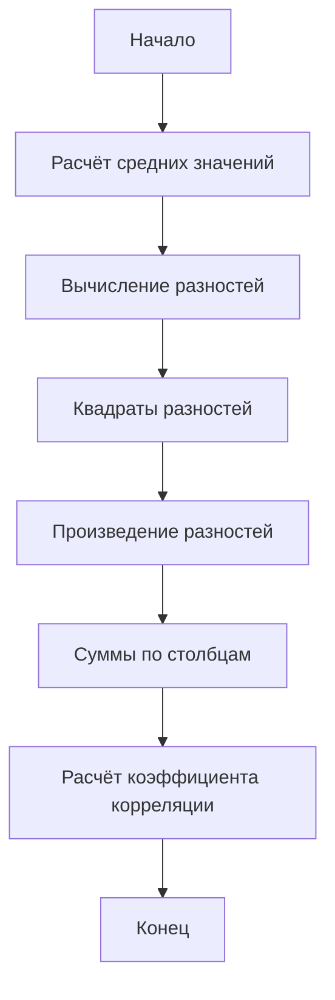

# Вычисление коэффициента корреляции

## Определение коэффициента корреляции

**Коэффициент корреляции** — это показатель, который позволяет определить степень взаимосвязи между двумя наборами числовых данных. В данном случае мы рассмотрим вычисление коэффициента корреляции между временем подготовки студентов к экзамену и их оценкой за экзамен.

## Пример расчёта коэффициента корреляции

Предположим, что у нас есть данные о времени подготовки и оценках за экзамен для пяти студентов:

1. Первый студент готовился 6 часов и получил за экзамен 7.
2. Второй студент готовился 7 часов и получил за экзамен 4.
3. Третий студент готовился 5 часов и получил за экзамен 1.
4. Четвёртый студент готовился 8 часов и получил за экзамен 10.
5. Пятый студент готовился 9 часов и получил за экзамен 8.

Для расчёта коэффициента корреляции нам необходимо выполнить следующие шаги:

### Шаг 1: Расчёт средних значений

Сначала рассчитаем среднее значение для времени подготовки:

$\bar{x} = \frac{6 + 7 + 5 + 8 + 9}{5} = 7$

Затем рассчитаем среднее значение для оценки за экзамен:

$\bar{y} = \frac{7 + 4 + 1 + 10 + 8}{5} = 6$

### Шаг 2: Вычисление разностей

Далее вычислим разности между временем подготовки для каждого студента и средним временем подготовки:

- $6 - 7 = -1$
- $7 - 7 = 0$
- $5 - 7 = -2$
- $8 - 7 = 1$
- $9 - 7 = 2$

Аналогично вычислим разности для оценки:

- $7 - 6 = 1$
- $4 - 6 = -2$
- $1 - 6 = -5$
- $10 - 6 = 4$
- $8 - 6 = 2$

### Шаг 3: Квадраты разностей

Теперь вычислим квадраты разностей для $x$ и $y$:

- $(-1)^2 = 1$
- $0^2 = 0$
- $(-2)^2 = 4$
- $1^2 = 1$
- $2^2 = 4$

Для $y$:

- $1^2 = 1$
- $(-2)^2 = 4$
- $(-5)^2 = 25$
- $4^2 = 16$
- $2^2 = 4$

### Шаг 4: Произведение разностей

Вычислим произведение разностей для $x$ и $y$:

- $(-1) \cdot 1 = -1$
- $0 \cdot (-2) = 0$
- $(-2) \cdot (-5) = 10$
- $1 \cdot 4 = 4$
- $2 \cdot 2 = 4$

### Шаг 5: Суммы

Рассчитаем суммы по каждому из трёх столбцов:

- Сумма для первого столбца: $1 + 0 + 4 + 1 + 4 = 10$
- Сумма для второго столбца: $1 + 4 + 25 + 16 + 4 = 50$
- Сумма для третьего столбца: $-1 + 0 + 10 + 4 + 4 = 17$

### Шаг 6: Расчёт коэффициента корреляции

Теперь можем рассчитать сам коэффициент корреляции:

$r = \frac{17}{\sqrt{10 \cdot 50}} \approx 0,76$

Таким образом, коэффициент корреляции между временем подготовки и оценкой за экзамен равен $0,76$. Это означает, что эти две величины связаны прямой и достаточно сильной связью.

## Визуализация процесса расчёта

Для наглядности процесс расчёта коэффициента корреляции можно представить в виде блок-схемы:

**Пояснение:** Данная блок-схема иллюстрирует последовательность шагов, необходимых для вычисления коэффициента корреляции.

